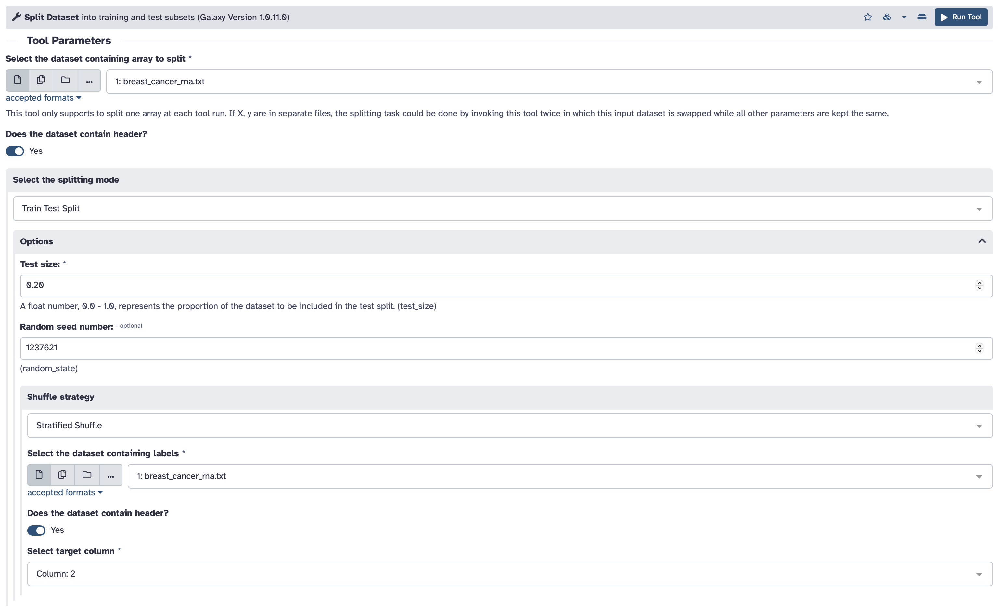

## Lab # 10 Machine Learning

## Table of Contents
1. [Introduction](#intro)
2. [Setting Up](#setup)
3. [The Problem](#problem)
4. [Defining Training and Testing Sets](#define)
5. [Training a Classification Model](#training)
6. [Evaluating a Classification Model](#testing)
7. [Tuning Classification Models](#tuning)

## Introduction

The goal of this lab is to build a machine learning classifier to predict breast cancer subtypes based on RNA-Seq data using the public Galaxy platform.

**Lectures** - [Lecture 10](https://github.com/agmcarthur/Biochem-3BP3/blob/master/Lectures/Houlahan_MachineLearning.pptx) Introduction to Machine Learning

**Flash Updates**
* *Random Forest* 
* *Logistic Regression* 
* *Natural Language Processing* 

**Background Reading** (optional)
* Whalen et al. 2022. Navigating the pitfalls of machine learning in genomics. [Nat Rev Genet. 23:169-81](https://pubmed.ncbi.nlm.nih.gov/34837041/)
* Thennavan et al. 2021. Molecular analysis of TCGA breast cancer histologic types. [Cell Genomics. 1:100067](https://pubmed.ncbi.nlm.nih.gov/35465400/) 

**Links**
* http://usegalaxy.org - this lab will be performed using the public Galaxy website, which was introduced in [Lab 6](https://github.com/agmcarthur/Biochem-3BP3/tree/master/Lab_6_Genome_Assembly) and used for RNA-Seq analysis in [Lab 9](https://github.com/agmcarthur/Biochem-3BP3/tree/master/Lab_9_RNASeq)

**Computer Resources**
* You can complete this entire lab by using your web browser

**Grading**
* Questions are for your learning and are not graded
* Problems are worth 5 points each (-1 for each error)
* Submit your answers to the Problems, plus any supplmental multiple choice questions, on **A2L Quizzes** before the deadline
* An answer key to Questions and Problems will be provided on A2L after the deadline

## Setting Up

Today’s lab will use the public server of the Galaxy project, http://usegalaxy.org, using the account you set up previously. 

## The Problem

Breast cancer is a molecularly heterogeneous disease. Treatment decisions are dependent on the presence of three protein receptors: [HER2, ER and PR](https://www.cancer.org/cancer/types/breast-cancer/understanding-a-breast-cancer-diagnosis/breast-cancer-hormone-receptor-status.html). The presence or absence of these three receptors categorizes tumours into three subtypes. 

| Subtype | Receptor | Prevalence | Survival (5 year) | Treatment | 
|----|:----:|:----:|:----:|----|
| ER+ | ER+ HER2- | 80% |>90% | Hormone therapy | 
| HER2+ | HER2+ |15-25% |~85% | Anti-HER2 therapy | 
| Triple Negative (TNBC) | ER- PR- HER2- |20% |77% | Chemotherapy 

We want to build a machine learning model that can differentiate ER+ versus TNBC tumours from transcriptomic profiling data (i.e., RNA-sequencing) to ensure patients receive the most effective treatment.

### Data

We are going to be use transcriptomic profiling of 48 genes in 848 tumours which have been clinically defined as ER+ or TNBC. The data can be found on GitHub in this Lab 10 folder: [breast_cancer_rna.txt](https://github.com/agmcarthur/Biochem-3BP3/blob/master/Lab_10_Machine_Learning/breast_cancer_rna.txt). The data is a tab-delimited file where each row corresponds to a tumour and the columns correspond to either the sample ID (`CLID`), the subtype of the tumour (`subtype`) or the mRNA abundance of a gene (e.g., `EGFR`). Here the subtype is encoded as a binary variable where `1 = TNBC` and `0 = ER+`. Use the upload tool to add these data to Galaxy:

Here is a glimpse of the data:

**Problem #1. Is the dataset balanced (ER+ versus TNBC)? What do we need to consider when training a model on this dataset?** (hint: try the **Histogram** or **Count** tools)

## Defining Training and Testing Sets

First, we want to set our training and testing cohorts. Here we are going to use 80% of our cohort for training while holding out 20% for testing. 

**Question #1. Here we are leaving out 20% of the data as a test set. What is another validation method could we use to evaluate our model?**

Use the **Split Data** tool to create the train and test partitions:

**Note:** Set a random seed. Some steps in machine learning are random and leverage random number generators. For example, randomly splitting cohort into training and testing sets. To ensure someone else can reproduce your analyses, it is important that this randomness is reproducible. You can set a random seed to ensure random number generators are initialized the same way each time. This will ensure even the randomness is reproducible.

**Problem #2. What is the ratio of ER versus TNBC tumours in the training dataset? What is the ratio in the testing dataset? How would this differ if we used the non-stratified shuffle strategy?**

> Flash Update - Logistic regression

## Training a Classification Model

We are going to build a classifier using a logistic regression model. A logistic regression model is a type of generalized linear regression that expects the response variable to be binary (0/1), i.e. ER+ versus TNBC tumour.

Train a logistic regression model on the training dataset using the **Generalized Linear Models** tool. Keep in mind **not** to include the sample IDs (e.g. TCGA-XX-XXXX-XX) as a feature in the dataset as we want to train the model to predict subtype based on the mRNA abundance of the 48 genes only.

**Note:** Reminder to set the random seed in the **Advanced Options** to ensure reproducibility.

In this section, we select the genes as these are the data powering the model to classify cancers:

In this section, we select *subtype* as the binary value to classifying new data (1 indicates a TNBC tumour, 0 indicates it a ER+ tumour):

**Question #2. What would happen if we accidentally left the sample ids as a feature in the model training?**

## Evaluating a Classification Model

Now that we have trained our model on our training set, we want to test it on the held-out 20% test set using the **Evaluate a Fitted Model** tool. Remember to remove the sample ID and subtype columns when predicting on the test set.

In this section, we select the genes as these are the data the model is evaluating to classify the cancer samples:

We are evaluating accuracy, so we need to compare our model's predictions against the clinical *subtype* labels:

**Question #3. What is the accuracy of your model?**

**Problem #3. Is accuracy is best metric to use to evaluate your model? What other metrics would you calculate?**

Try adding the additional scoring metrics using the `Additional scoring used in multi-metric mode` dropdown. 

**Question #4. How do the additional metrics compare to accuracy? If they differ, why?**

> Flash Update - Random Forest

## Tuning Classification Models

Of course, logistic regression is not the only classification model available. Try training and testing another classification algorithm using the same steps outlined above.

**Question #5. Which classification algorithm did you choose and why? How did its performance compare to logistic regression?**

> Flash Update - Natural Language Processing

**Problem #4. Aside from selecting a new algorithm, what other model tuning could you test to improve prediction performance?**

## Predicting on Microarray Data

Comprehensively evaluating model performance requires testing the model on a completely unseen cohort. This evaluation more accurately reflects the anticipated performance when the model is applied in a real-world setting. **You should never look at the performance of the model on this cohort before picking a final model.**

In our case, we are going to apply our model, trained on RNA-sequencing, to predict the breast cancer subtype of an independent cohort of 1,733 tumours profiled with microarrays. The mRNA abundance of the same 48 genes have been measured. The data can be found on GitHub in the Lab 10 folder: `breast_cancer_microarray_prediction.txt`. The data is a tab-delimited file where each row corresponds to a tumour and the columns correspond to either the sample ID (`CLID`), the subtype of the tumour (`subtype`) or the mRNA abundance of a gene (e.g. `EGFR`). Again, here the subtype is encoded as a binary variable where `1 = TNBC` and `0 = ER+`.

Using the same approach as outlined in `Evaluating a Classification Model`, evaluate your final prediction model (either the logistic regression model or the model you trained in `Tuning Classification Models`) on the independent microarray data.

**Problem #5. How well did your model perform on the microarray data? What are some factors that may influence model performance?**