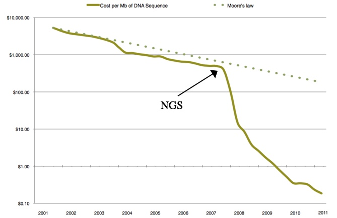
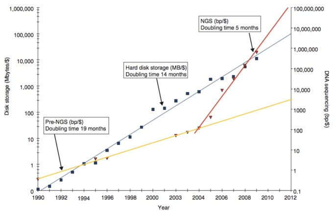
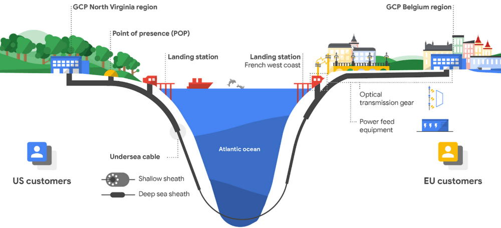
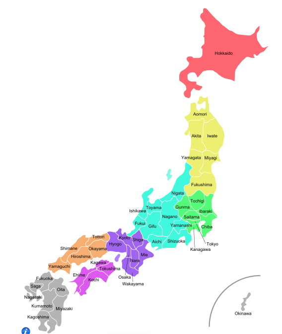

## Lab # 1 - Introduction to the Laboratory & Genome Databases

## Table of Contents
1. [Introduction](#intro)
2. [Moore's and Kryder's Laws](#laws)
3. [National Center for Biotechnology Information](#ncbi)
4. [PubMed](#pubmed)
5. [GenBank / Entrez](#genbank)
6. [BLAST](#blast)
7. [Ensembl](#ensembl)

<a name="intro"></a>
## Introduction

The goal of this lab is to introduce two key bioinformatics databases – GenBank & Ensembl – plus a few additional online resources.

**Lecture:** [Lecture 1 slides](https://github.com/agmcarthur/Biochem-3BP3/blob/master/Lectures/Lecture%201%20-%20Introduction.pptx) Introduction to Bioinformatics & the Course ([~42 minute video](https://mcmasteru365-my.sharepoint.com/:v:/g/personal/mcarthua_mcmaster_ca/EbosmwqNKeBHpcVRQMEI0QsBBxIxgC0PS6ZtKGkbMbX_hQ))

**Flash Updates**
* *GenBank* 
* *Ensemble* 
* *Growth of Sequencing Data* 

**Demo Videos**
* [Intro & Undersea Cables](https://mcmasteru365-my.sharepoint.com/:v:/g/personal/mcarthua_mcmaster_ca/Ednxa2wKV4RKvjC364HiwDYBZVCRa0xtu13wkQh3HnrMrA) ~4 minutes
* [PubMeD](https://mcmasteru365-my.sharepoint.com/:v:/g/personal/mcarthua_mcmaster_ca/EdZVnIH3XUZJoEg2zQXHqv4BFe4uQGIVTgdIn6Q1-LfZDQ) ~5 minutes
* [GenBank & BLAST](https://mcmasteru365-my.sharepoint.com/:v:/g/personal/mcarthua_mcmaster_ca/EdPwIBaqq7hEofEKfux_eycBgmD6QmE-XjdlfdcFZw7JRQ) ~13 minutes
* [Ensembl](https://mcmasteru365-my.sharepoint.com/:v:/g/personal/mcarthua_mcmaster_ca/EbIIq_NbMotCjqySXVNyJv8BoUc7bmPeHDboIIWZLBE1Qg) ~15 minutes

**Background Reading** (optional)
* J. Chang. 2015. Core services: Reward bioinformaticians. [Nature 520:151-2](https://www.ncbi.nlm.nih.gov/pubmed/?term=25855439)
* Goodman et al. 2014. Ten simple rules for the care and feeding of scientific data. [PLoS Comput Biol. 10(4):e1003542](https://www.ncbi.nlm.nih.gov/pubmed/?term=24763340)
* Burge et al. 2012. Biocurators and biocuration: surveying the 21st century challenges. [Database Mar 20:bar059](https://www.ncbi.nlm.nih.gov/pubmed/?term=22434828)

**Links**
* NCBI & GenBank, http://www.ncbi.nlm.nih.gov
* Ensembl, https://www.ensembl.org

**Computer Resources**
* You can complete this entire lab by using your web browser

**Grading**
* Questions are for your learning and are not graded
* Problems are worth 5 points each (-1 for each error)
* Submit your answers to the Problems, plus any supplmental multiple choice questions, on **A2L Quizzes** before the deadline
* An answer key to Questions and Problems will be provided on A2L after the deadline

<a name="laws"></a>
## Moore's and Kryder's Laws

> Flash Update - Growth of Sequencing Data

You were introduced to Moore's and Kryder's laws in the lecture:

* Moore’s Law: computer processor speed doubles every 18 months
* Kryder’s Law: disk storage capacity doubles every 14 months

To put it another way, if you had $5000 dollars to spend on processors or hard drives, here is what you would get for this money now and over the next few years:

**Processors**

* Today: **X** processing power
* 18 months from today: **2X** processing power
* 36 months from today: **4X** processing power

**Hard Drives**

* Today: **Y** storage capacity
* 14 months from today: **2Y** storage capacity
* 28 months from today: **4Y** storage capacity

That big announcement of a new phone or gaming platform? They are roughly every 14-18 months as new chip classes or drive technologies come online to double capacity. Companies depend on doubling of how much they get for their purchasing dollar. This drives the technology market. But what if your data is coming in faster than either Moore's or Kryder's law? Will it all break down? That is the big concern for the future of next-generation DNA sequencing:



_Sboner et al. 2011. The real cost of sequencing: higher than you think! Genome Biol. 12(8):125._



_Stein. 2010. The case for cloud computing in genome informatics. Genome Biol. 11(5):207._

<a name="ncbi"></a>
## National Center for Biotechnology Information (NCBI)

The NCBI is one of the dominant international data repositories for biomedical data, hosted by the US Government’s National Library of Medicine at the National Institutes of Health in Bethesda, Maryland. It is often referred to as GenBank, but this name actually refers to only a subset of its data and tools. The NCBI leads international data integration efforts, particularly with the European Molecular Biology Laboratory (EMBL) and the DNA Data Bank of Japan (DDBJ). The origins and success of the NCBI is tightly tied to the origins and success of the Internet – GenBank came online in 1992.  Modern bioinformatics research is highly dependant upon the Internet and this is best exemplified by the NCBI. As such, we are going to start by looking at the global network infrastructure, since bioinformatics is increasingly a global enterprise.


See [Submarine Cables: the Invisible Fiber Link Enabling the Internet](https://dgtlinfra.com/submarine-cables-fiber-link-internet/).



_Map of Japan. Source: Wikipedia_

**Question #1. Take a look at http://www.submarinecablemap.com, with the map above as a guide. How many submarine cable landing points does Japan have (excluding Okinawa)?** 

**Question #2. How many cable links are between Russia and Japan?**

**Question #3. If you were accessing the deCODE database in Iceland (http://www.decode.com), name three countries that the data could traverse to get to you here in Canada.**

**Question #4. Undersea cables can be broken by dragging ships anchors or ill-positioned fishing trawlers. If you were doing your PhD on the genomics of the Eua Forest Gecko *Lepidodactylus euaensis* in Tonga, how many undersea cables would need to be damaged for you to lose access to the NCBI?** (note: demo video discusses French Polynesia instead)

<a name="pubmed"></a>
## PubMed

Change websites to the NCBI Homepage, http://www.ncbi.nlm.nih.gov, and select PubMed on the right hand side.  The search box will accept general terms, author names, or PubMed Identifiers (PMID). Yet, PubMed offers much more advanced tools for literature mining. Click on the Advanced link below the search box and use these tools to answer the following questions:

**Question #5. Which journal did Nick Waglechner (a recent PhD graduate in Biochemistry) publish his first paper in?**

**Question #6. How many times have Nick Waglechner and Andrew McArthur published together?**

**Question #7. Search for the term *NDM-1*, which is an antibiotic resistance gene of considerable importance. What year was it first reported in the literature?**

**Question #8. How many papers were published on *NDM-1* in 2014?**

**Question #9. Enter the full citation for the paper originally describing NDM-1, its PubMed identifier, plus how many times it has been cited in the literature.**

Go back to the PubMed home page (http://pubmed.gov) and select the *MeSH Database* and then the Advanced link below the search box. MeSH is a *controlled vocabulary* that organizes PubMed using standardized language. This means that no matter the words and phrases authors use in their publications, they are all searchable via commonly assigned MeSH terms. Search for MeSH terms relating to *antibiotic resistance*. 

Examine the MeSH term *Drug Resistance, Microbial* to see the diversity of related MeSH terms. You will note the term had its origins in 1963 – antimicrobial resistance (AMR) is not a new problem. Use the search builder on the right to search for papers related to the term *Drug Resistance, Microbial*.

**Question #10. Use the search builder on the right to search for papers related to the term *Drug Resistance, Microbial*. In what decade did the number of publications per year on AMR start its rise to their current levels (i.e. over 5000 papers per year)?**

If you are doing a research project, after you find a successful set of search terms note that under the search box you can Create RRS and Create Alerts, thus using MeSH terms to set your target range of literature and receive periodic updates on the papers that match your search criteria. Most researchers now use algorithms and software to help them keep up with the scientific literature.

<a name="genbank"></a>
## GenBank / Entrez

> Flash Update - GenBank

The above exercise illustrates how the combination of data (i.e. citation information), classification (i.e. controlled vocabularies) and unique identifiers (i.e. PMID) can be used to generate powerful informatics resources. Similar efforts exist for gene sequences. Return to the NCBI homepage, http://www.ncbi.nlm.nih.gov, and search all databases for the drug *colistin*. This gives you a sense of the diversity of data available for a single drug: associated genes, gene expression (GEO), chemical assays, and chemical compound data. Note that there are over 3,000,000 protein sequences that have an association with colistin. Click on the *Protein* link to view the list and you’ll see the top of the list is predominantly Mcr and Pmr proteins. Focus on one of these proteins by searching for accession AGK23098.1 (PmrA) to view GenBank Format Data, a verbose file format for describing molecular data. While software has been developed to read GenBank format, it is primarily for human consumption.

**Question #11. Find the following information in the GenBank data file:**

* Organism this sequence is from?
* Which genetic code does this organism use?
* GenBank accession
* How many amino acids in this protein?
* Which residues (amino acids) are involved in DNA binding?
* GenBank accession for the corresponding DNA sequence

An important feature of GenBank data is the use of Accession numbers as these are reported in the scientific literature. However, if an author or sequencing centre submits a correction to the sequence, the Accession remains unchanged (it is immortal - so the scientific literature does not become stale) but is now given a version sub-identifier. To make this clear, record the following:

**Question #12. Accession and Versioned Accession for the sequence above.**

In the scientific literature and in discussion, researchers predominantly refer to GenBank entries by their Accession number as GenBank will always provide them with the latest version only. 

<a name="blast"></a>
## BLAST

GenBank is not just for browsing data, but instead you can search based on sequence. Next week’s lecture and lab is going to detail the Basic Local Alignment Search Tool (BLAST) algorithm, but try it now to see what is does by clicking on the *Run BLAST* link. This will launch an interface to compare your Pmr protein against curated reference proteins in GenBank: select **Non-redundant protein sequences (nr) & 500 Max Target Sequences**.

**Record the Request ID (RID) of your search, so you don't have to repeat it later (expires after 24 hours)**

**Question #13. Which functional domains are predicted in your protein and what does each do (select on Graphic Summary and click on the domain for details)?**

**Question #14. Give the % identity of the best “hit” and the worst “hit”.**

Now please edit your BLAST search to find **5000 targets** but filter for **Vertebrata (taxid:7742)** hits.

**Question #15. Take a look at the Taxonomy report for this edited BLAST search. Are there any similar proteins in vertebrates?**

**Problem #1. You have found non-bacteria proteins similar to a bacterial Pmr protein. Picking one as an example, note the Accession, look up the GenBank file, perform BLAST as above (but using 500 targets and remove the Vertebrata (taxid:7742) filter) and then look at the “Distance Tree of Results”. Do you think this gene is part of that genome or a possible sequence contaminant? Use the information in the GenBank record, the BLAST results, and the Tree to make your decision.**

<a name="ensembl"></a>
## Ensembl

> Flash Update - Ensembl

The Ensembl database is a joint effort of the European Bioinformatics Institute and The Welcome Trust Sanger Institute. It has its origins in the sequencing of the human genome and was launched in 1999. Unlike NCBI, it is organized around the genome sequencing of specific organisms and the resulting annotation of those genomes. Outside of very browsable data, Ensembl has two major strengths: (1) extensive data downloads in a variety of formats and (2) powerful genome browser tools. This part of the lab is going to focus on use of Ensembl to better understand the genome of the model organism _Danio rerio_ (aka zebrafish). To start, go to the Ensembl home page (https://www.ensembl.org) and view the full list of all Ensembl species.

**Question #16. Examining the phylogenetic tree, what is the most closely related genome to the zebrafish in Ensembl? Give both the common and scientific name.**

Go to the Ensembl _Danio rerio_ home page. It is important to realize that there are two independent efforts underway in the zebrafish. The first is the active sequencing of the zebrafish genome and the second is the annotation of that genome. We are going to discuss genome sequencing later in the course. Annotation is a secondary effort where the resulting genome sequences are annotated with predicted genes, regulatory regions, etc. Genome sequencing periodically releases updates of the predicted genome sequence (called an assembly) while annotation is a nearly continuous effort that Ensembl updates as annotation releases. 

**Question #17. View the “More information and statistics” link and answer the following questions.**

* Which zebrafish genome assembly version is the most current and when was it released?
* What is the corresponding GenBank Assembly ID?
* How many base pairs long is the latest assembly and how many have been mapped to the chromosomes (i.e. Golden Path)?
* You will see that this assembly was annotated using Ensembl’s automatic annotation pipeline. What is the current Ensembl database version?
* How many protein coding genes are predicted for the latest assembly?

Now that you have an idea of what the zebrafish genome is composed of, use the search box to search for *aromatase* and you’ll see the data follows the Central Dogma – gene, transcript, protein, protein family. Select the cyp19a1a gene page. CYP19 is a P450 protein responsible for biosynthesis of estrogens.

**Question #18. Open the transcript table so you can see that additional data and answer some questions about this aromatase encoding gene.**

* What is the Ensembl accession for the gene (i.e. DNA)?
* What is the Ensembl accession for the transcript (i.e. RNA)?
* What is the Ensembl accession for the protein?
* What are the chromosome co-ordinates for the gene?
* Is the gene on the forward or reverse strand? What does that mean?

**Question #19. Click on the Transcript ID to learn about the transcript.**

* How many exons and introns does this gene have?
* How long is the gene (hint: co-ordinates above)?
* How long is the resulting mRNA resulting from transcription & splicing?
* How long is the protein resulting from translation?

Click on the hyperlink location co-ordinates to bring up Ensembl’s genome browser and hit the minus symbol to zoom out slightly. While genome sequencing produces the zebrafish genome sequence (A, C, G, Ts) additional data are needed to predict genes. This can be experimental data or computational predictions. Three types of data are available in this case: computational prediction of gene/intron/exon (EST cluster), sequencing of mRNA (labelled cDNAs), and BLAST matching of proteins from other sequenced genomes. Prediction of intron/exon splicing boundaries can be particularly tricky.


_mRNA Splicing. Source: Wikipedia_


_Introns and Exons (py = pyrimidines, i.e. C or U). Source: Wikipedia_

**Problem #2. Zoom into exon 3 and exon 4 to examine the third intron. Remember this gene is in the reverse strand! Where questions marks are in the figure below, enter the corresponding nucleotides (in UPPERCASE) from the zebrafish genome that correspond to the first four and last four nucleotides of the intron. Use all the available data to make your decision by using the *Configure this page* tool:**

* try turning on all the *genes and transcripts* tracks unstacked / expanded (without labels)
* also try turning all the *mRNA and protein alignments* tracks unstacked / expanded (without labels)

```bash
5’--------exon3????-------????exon4----------3’
```

* Did the computational predictions (EST) and mRNA sequencing (cDNAs) match? If not, how did they differ and which did you use to answer the above question?
* Are the splicing sites canonical? If not, would you revise your exon/intron model?

**Problem #3. Look up human CYP19A1 (aromatase) in Ensembl.**

* How many different transcripts have been predicted?
* How many are protein coding?
* How many exons encode the canonical CYP19A1 protein (503 aa)?
* What is this transcript’s [Transcript Support Level](https://grch37.ensembl.org/info/genome/genebuild/transcript_quality_tags.html)? Do you think it is a real transcript?
