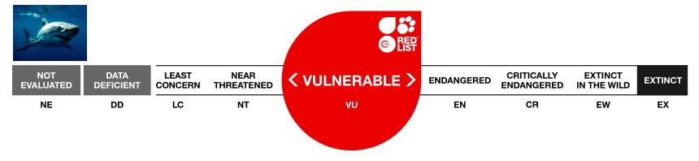
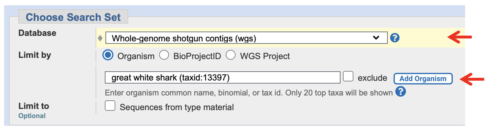
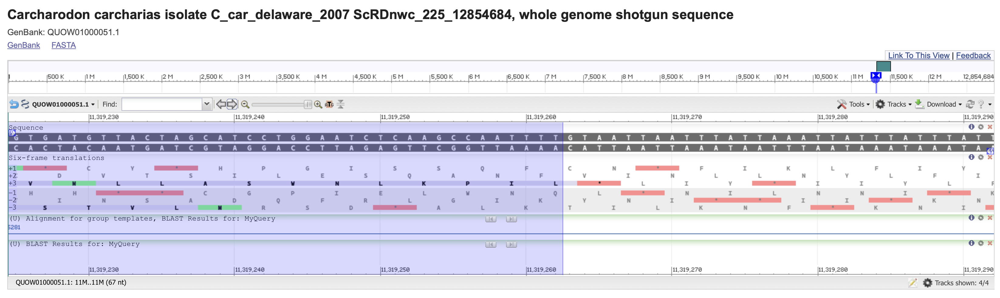
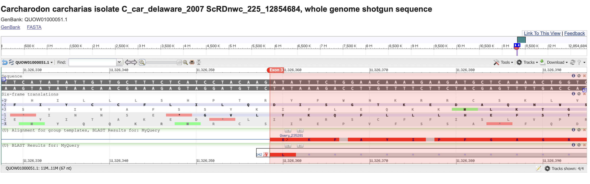
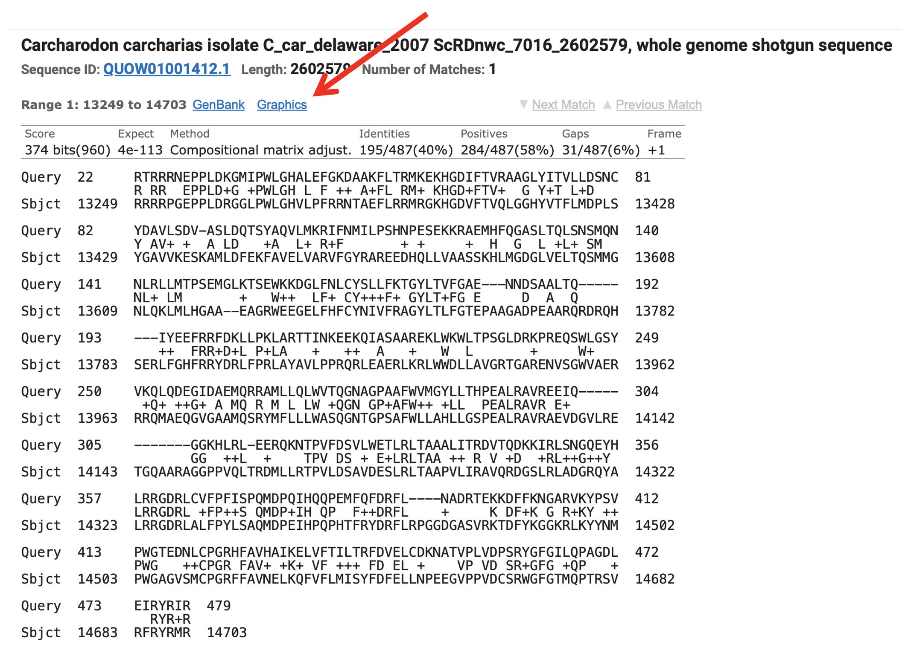
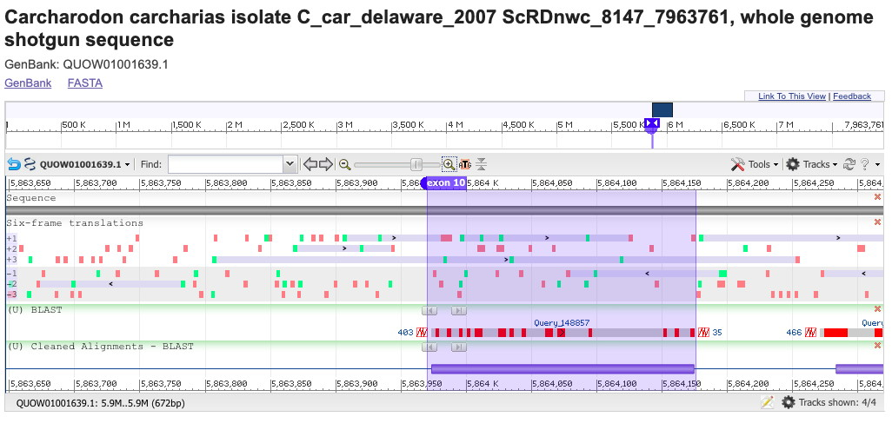
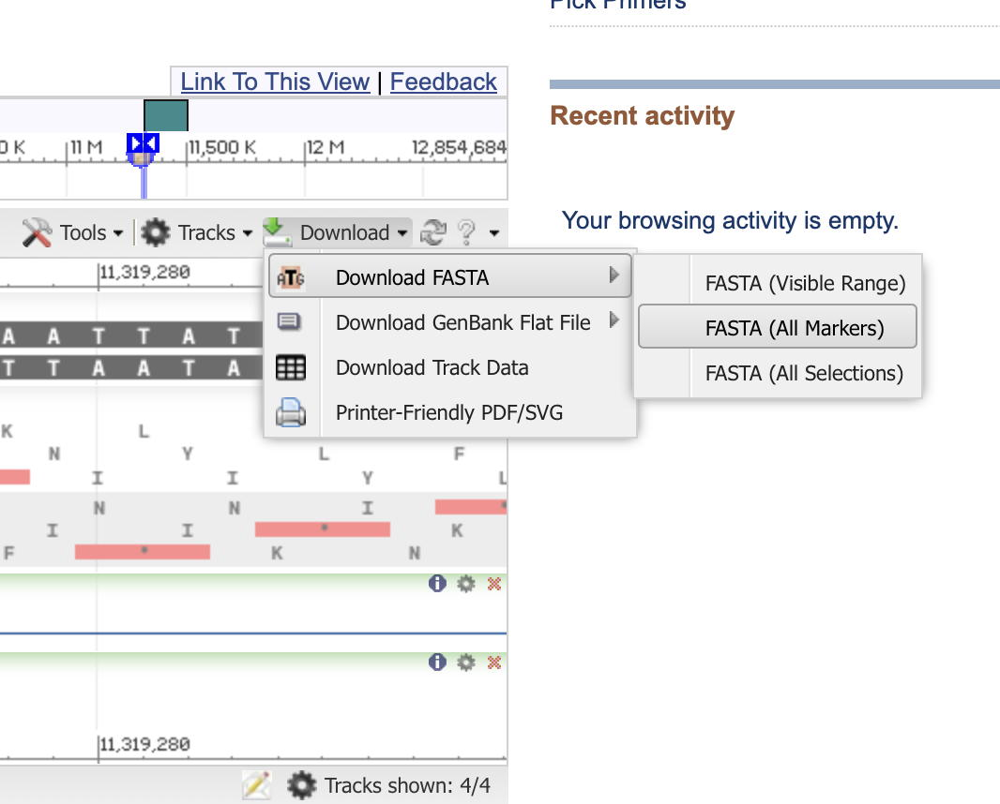

## Lab # 2 - Protein Annotation & Gene Finding

## Table of Contents
1. [Introduction](#intro)
2. [Carcharodon carcharias & Splicing](#shark)
3. [Finding Putative P450s via BLAST](#blast)
4. [Predicting a Single P450 Gene](#p450)
5. [Annotating a Single P450 Gene](#annotate)

## Introduction

The goal of this lab is to annotate the P450 proteins in the recently sequenced Great White Shark genome, using BLAST, Pfam, and other tools plus a number of available databases. This is a problem-based learning lab and you will work both collectively and individually. The results of this week’s lab will be used in next week’s evolution lab.

**Lecture:** - [Lecture 2 slides](https://github.com/agmcarthur/Biochem-3BP3/blob/master/Lectures/Lecture%202%20-%20Sequence%20Searching.pptx) Sequence Similarity & Searching

**Flash Updates**
* *BLAST*
* *Pfam*
* *PROSITE*

**Demo Videos**
* [Introduction to P450s & The Great White Shark](https://mcmasteru365-my.sharepoint.com/:v:/g/personal/mcarthua_mcmaster_ca/EVlSruy12RBAq5-3kwudtEMBAqWdUvWDiz-4xExGFOvbtw) (Dr. Joanna Wilson, Department of Biology, McMaster University) ~8 minutes
* [Complete walkthrough with a simple gene (no introns)](https://mcmasteru365-my.sharepoint.com/:v:/g/personal/mcarthua_mcmaster_ca/EdhCIWf8b7NEg4i5Eocv6mQBX1frZs026LaJZUi0vJhu4A) ~30 minutes
* [Defining introns and exons in the GenBank genome browser](https://mcmasteru365-my.sharepoint.com/:v:/g/personal/mcarthua_mcmaster_ca/ET1-WLP1MKdCtYy9ImHFFBgBWwhSOgJLBGGlSzCDEQrK2w) ~23 minutes

**Background Reading** (optional)
* Marra et al. 2019. White shark genome reveals ancient elasmobranch adaptations associated with wound healing and the maintenance of genome stability. [Proc Natl Acad Sci U.S.A. 116:4446-4455](https://www.ncbi.nlm.nih.gov/pubmed/30782839)
* Altschul et al. 1990. Basic local alignment search tool. [J Mol Biol. 215: 403-10](https://www.ncbi.nlm.nih.gov/pubmed/?term=2231712)
* Eddy. 2004. What is a hidden Markov model? [Nat Biotechnol. 22:1315-6](https://www.ncbi.nlm.nih.gov/pubmed/?term=15470472)
* Haft 2015. Using comparative genomics to drive new discoveries in microbiology. [Curr Opin Microbiol. 23: 189-96](https://www.ncbi.nlm.nih.gov/pubmed/?term=25617609)

**Links**
* NCBI & GenBank, http://www.ncbi.nlm.nih.gov
* Ensembl, http://www.ensembl.org
* *Carcharodon carcharias* genome, https://www.ncbi.nlm.nih.gov/nuccore/QUOW00000000.1/
* NCBI TBLASTN, https://blast.ncbi.nlm.nih.gov/Blast.cgi?PROGRAM=tblastn&PAGE_TYPE=BlastSearch&LINK_LOC=blasthome
* Translate tool, http://web.expasy.org/translate/
* Pfam (at InterPro), https://www.ebi.ac.uk/interpro/
* Prosite, http://prosite.expasy.org

**Computer Resources**
* You can complete this entire lab by using your web browser

**Grading**
* Questions are for your learning and are not graded
* Problems are worth 5 points each (-1 for each error)
* Submit your answers to the Problems, plus any supplmental multiple choice questions, on **A2L Quizzes** before the deadline
* An answer key to Questions and Problems will be provided on A2L after the deadline

## *Carcharodon carcharias*

_Carcharodon carcharias. Source: IUCN Red List of Threatened Species_

Dr. Joanna Wilson (Department of Biology, McMaster University) will introduce *Carcharodon carcharias* (great white shark) and its importance for evolutionary biology, with a focus on the P450 enzymes in the defensome (see [Introduction to P450s & The Great White Shark](https://mcmasteru365-my.sharepoint.com/:v:/g/personal/mcarthua_mcmaster_ca/EVlSruy12RBAq5-3kwudtEMBAqWdUvWDiz-4xExGFOvbtw) video). Using query sequences from the zebrafish genome, it is your job to use the BLAST tools and genome browser at NCBI to collectively find all the putative P450 genes in this genome. 

In the class Teams under *Files -> Lab 2* you will find spreadsheets for the T01, T02, and T03 tutorials with individually assigned query P450s and columns for notes as you complete the lab. These zebrafish proteins can be found at Ensembl, http://www.ensembl.org.

> Ensembl giving errors? You can also obtain your protein sequence via ZFIN: [demo video](https://mcmasteru365-my.sharepoint.com/:v:/g/personal/mcarthua_mcmaster_ca/EZPApFVb-m5EgVW66B8dHMkBcvhk4_4_1Z7ixFpWIkmRQQ)

Once the class had developed a list of putative genes, each student will be assigned a gene to map out intron/exon boundaries and the predicted protein sequence. Remember what you have learned about splicing sites:

_mRNA Splicing. Source: Wikipedia_

## Finding Putative P450s via BLAST

> Flash Update - BLAST

Using your query sequence (as protein!) in FASTA format, search the *Carcharodon carcharias* genome sequence at NCBI for all the possible P450 genes. Remember, since you are submitting a protein query against a genome that contains both introns & exons, a single putative P450 gene will likely have multiple High-scoring Segment Pairs (HSPs). Also, since all P450s are related, your single query may detect more than one putative P450 gene. 

NCBI TBLASTN: https://blast.ncbi.nlm.nih.gov/Blast.cgi?PROGRAM=tblastn&PAGE_TYPE=BlastSearch&LINK_LOC=blasthome

Customize your search to focus on the *Carcharodon carcharias* genome assembly:

**Record your TBLASTN Request ID (RID) so you don't loose your results (expires after 24 hours)**

**Question #1. How many HSPs in your best BLAST hit?**

**Question #2. How many possible P450 genes did your search identify? What was your cut-off?**

Once you have generated a list of possible P450 genes in *Carcharodon carcharias* based on your query, **enter the number of HSPs generated by your query as well as the contig accession of your top BLAST hit into the class spreadsheet** so we can generate a master list from all queries.

**Question #3. What is the class’ prediction of the number of P450 genes in this genome based on the best BLAST hits?**

**Problem #1. Were any of the genes predicted by the class found on the same contig accession? What does this say about our collective search method and P450 genes in this genome?**

## Predicting a Single P450 Gene

While the class generates a master list of putative P450s, you will annotate your best BLAST hit (based on the HSP with the lowest expectation value). Using NCBI’s BLAST and genome browser tools, work to define the complete gene and answer the questions below. 

**Important Points:**
* Only the first exon begins with a start codon
* Only the last exon ends with a stop codon
* Exons do not have to be in the same frame and exons may not have complete codons at the 5' or 3' end - all that matters is that after splicing the sequence can be translated into a complete protein

For example, this is the 3' end of exon 2 of a putative P450. The exon is in the +3 strand and highlighted in purple. The exon ends part way through a codon encoding L. The downstream intro starts with the canonical splice site GT:

Continuing the example, this is the 5' end of exon 3 of the same putative P450. The exon is also in the +3 strand and highlighted in red. We are now viewing the 3' end of the intron, with the canonical splice site AG:

To view the NCBI Genome Browser, view the best HSP for your TBLASTN hit and select the *Graphics* link, e.g.

**Note that the co-ordinates in the HSP alignment will help you determine which strand your putative P450 is encoded upon, i.e. forward or reverse strand.**

In the NCBI Genome Browser: 

* Configure the Tracks to include a custom track for your TBLASTN results using your RID and then zoom out until you see all the HSPs. 
* If your gene is on the reverse strand, you may want to use *Tools -> Flip Strands*.
* Turn on the *Six-frame translations* track when you are zoomed in on putative exons so you can better visualize the start and stop codons relative to the splice sites.

Your goal is to *Set Markers* for each exon in your putative P450 gene, using the TBLASTN hits to guide you to exons and your inspection of the sequence to identify the correct splice sites. If you drag/highlight a region of sequence, you can *Set New Marker for Selection* and subsequently rename it and tweak its co-ordinates. For example:

Once you have all the exon sequences, you can download them all:

Once you have all the exon sequences, stitch together a theoretical mRNA and translate it to obtain your putative P450 protein sequence using http://web.expasy.org/translate.

To check you have a proper P450, submit your predicted protein sequence to BLASTP against GenBank: https://blast.ncbi.nlm.nih.gov/Blast.cgi?PROGRAM=blastp&PAGE_TYPE=BlastSearch&LINK_LOC=blasthome

**Question #4. List the query used to initially predict your gene (e.g. CYP4V7 in zebrafish, CYP6A2 in fruit fly).**

**Question #5. List your gene's co-ordinates within the genome assembly (possibly includes introns):**
* Contig Accession: 
* 1st base of Start codon: 
* 3rd based of Stop codon:
* Strand:

**Problem #2. How many exons are in your P450 gene? List their co-ordinates. Do you think your gene model is correct or do you have concerns about your exon detection and intron/exon boundaries? Why?**

## Annotating a Single P450 Gene

> Flash Update - Pfam

> Flash Update - PROSITE

**Paste your putative P450 protein sequence into a WORD file and keep a copy of it for next week.**

**Question #6. How many amino acids long is your putative P450? Is this length similar to P450 proteins in GenBank from other organisms?**

**Question #7. What [Pfam](https://www.ebi.ac.uk/interpro) domains are predicted for your protein sequence? What predictions can you make about the function of this protein?**

**Question #8. What [PROSITE](http://prosite.expasy.org) motifs are predicted for your protein sequence? What predictions can you make about the function of this protein?**

**Problem #3. Include your predicted protein sequence as part of this answer so the TA can assess your putative P450. Given all your analysis results, including BLAST against GenBank, can you predict which P450 family or subfamily this protein belongs to (e.g. CYP2, CYP4, CYP19, etc.)? Do you think it is functional? Remember:**
* CYPs > 40% identical aa in same family (numeric)
* CYPs > 55% identical aa in same subfamily (alpha)

This completes today’s laboratory. The protein you predicted today will be used in the next lab, which uses phylogenetics to further determine the accuracy of your prediction plus test your P450 family assignment. **DO NOT LOSE YOUR PROTEIN SEQUENCE**.

