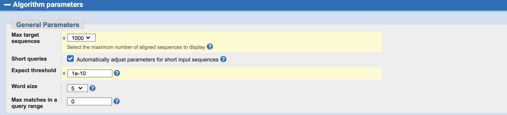

## Lab # 3 - Phylogenetics

## Table of Contents
1. [Introduction](#intro)
2. [Multiple Sequence Alignment](#msa)
3. [Alignment Editing](#edit)
4. [Maximum Likelihood Phylogenetic Tree](#raxml)
5. [Phylogenetic Tree Interpretation](#tree)

<a name="intro"></a>
## Introduction

In the last lab you worked to identify and develop a gene model for a putative P450 gene in the *Carcharodon carcharias* genome. Using the available evidence, you worked to define intron and exon boundaries as well as predict the encoded protein sequence. Yet you may have questioned whether your exons were under- or over-estimated and whether you missed any exons. Additionally, you used BLAST, Pfam, and PROSITE to provide a first-pass assignment to P450 family and subfamily. The goal of this lab is to use the methods of evolutionary biology to examine the accuracy of your gene model and preliminary annotation. 

**Lectures** - [Evolutionary Biology](https://github.com/agmcarthur/Biochem-3BP3/blob/master/Lectures/Lecture%203%20-%20Evolutionary%20Biology.pptx)

**Flash Updates**
* *Terminology*. Explain the difference between the terms “similarity” and “homology”. Differentiate between the terms “homolog”, “paralog”, “ortholog”. See [Annu Rev Genet. 2005;39:309-38](https://www.ncbi.nlm.nih.gov/pubmed/?term=16285863) and http://www.ncbi.nlm.nih.gov/books/NBK62051/.
* *Sequence Alignment*. Explain the difference between local alignment (e.g. BLAST) and global alignment (e.g. CLUSTAL) and introduce the CLUSTAL family of algorithms. See [Protein Sci. 2018 Jan;27(1):135-145](https://www.ncbi.nlm.nih.gov/pubmed/?term=28884485).
* *Phylogenetic Trees*. Overview what a phylogenetic tree represents and the major concepts for its interpretation. See Baum 2008. Reading a phylogenetic tree: The meaning of monophyletic groups. [Nature Education 1: 190](http://www.nature.com/scitable/topicpage/reading-a-phylogenetic-tree-the-meaning-of-41956).

**Background Reading** (optional)
* Dejong & Wilson. 2014. The Cytochrome P450 superfamily complement (CYPome) in the annelid *Capitella teleta*. [PLoS One 9:e107728](https://www.ncbi.nlm.nih.gov/pubmed/?term=25390889)
* Bos et al. 2011. A draft genome of *Yersinia pestis* from victims of the Black Death. [Nature 478: 506-10](https://www.ncbi.nlm.nih.gov/pubmed/?term=21993626)

**Links**
* Clustal, http://www.clustal.org
* Mesquite, http://www.mesquiteproject.org
* RAxML Blackbox at CIPRES, http://www.phylo.org/index.php/
* Archaeopteryx, https://sites.google.com/site/cmzmasek/home/software/archaeopteryx 
* NCBI Tree Viewer, http://www.ncbi.nlm.nih.gov/projects/treeview/

**The Lab**
* The computers in the laboratory are terminals – clients within a large maintained computer system. They have limited computational power – often we will be using them to access web-based tools or specialized servers with more computational resources.
* You log into the computers using your MacID. You will be automatically logged out after 10 minutes of mouse inactivity. Use **CAFFEINE** to override the automatic log out – **REMEMBER TO LOG OUT MANUALLY AT THE END OF THE LAB**.
* All files and work on the computers will be lost when you log out. Be sure to save your work elsewhere. 

```bash
If needed, change the Properties of your User folder found in:

Computer -> UDiskBOOT -> Users

Please de-select the “Read-only” option as demonstrated. 
```

**Submit for Grading:**
* The WORD file for answers is available on A2L, be sure to submit your answers on **A2L Quizzes** before the deadline. **4 points (1 point per question)**
* Your FASTA sequence file (seqdump.txt) **1 point**
* Your PHYLIP alignment file (seqdump.txt.phy) **1 point**
* Your RAxML tree file (RAxML_bipartitions.seqdump.txt). As the RAxML Black Box is a shared resource and can by busy, there is no deadline for uploading your tree file to Avenue to Learn but the final grade for the lab will not be awarded until it is handed in. **1 point**

<a name="msa"></a>
## From Sequences to a Multiple Sequence Alignment

We are first going to compare our predicted sequences to related sequences in other organisms, to see if we found an overall similar protein or perhaps our protein has missing or extra amino acids due to incorrect exon predictions. 

To perform this analysis, go to the NCBI BLASTP page and submit your sequence as a query against the **non-redundant protein sequences (nr), for 5000 targets, hits restricted to vertebrates and expectation value e-10 or better**: http://blast.ncbi.nlm.nih.gov/.




**Record your BLASTP Request ID (RID) so you don't loose your results (expires after 24 hours)**

> Flash Update - Terminology

When you have your BLAST results, you will see *Other Reports* -> *Distance Tree of Results*. Please examine this tree and following the demonstration, use the tree and the taxonomy report to guide selection of 30-40 sequences in your BLAST report for further analysis. Your selection criteria are to sample a diverse range of P450 subfamilies and a diverse range of organisms in your P450’s family and subfamilies, plus hopefully a few sequences from an outgroup P450 family. **If possible, include representative P450s from fish, reptiles, and mammals from at least two subfamilies. Avoid invertebrates.**

**Question #1. What P450 family is your gene from? Which subfamilies are represented in your sequences. Do you have an outgroup and if so, what is it?**

Once you have selected your sequences, use the BLAST results page to download them all in FASTA (complete sequence) format:

```bash
Computer -> UDiskBOOT -> Users -> username -> Downloads -> seqdump.txt
```

Find the download file and right-click on it to open it in WordPad, then select *View -> Word Wrap -> No Wrap*. You should now see your selected sequences in FASTA format, a common format for storing sequences. We will discuss the FASTA format and its history later in the course. Using WordPad, edit the file to add your *S. kowalevskii* protein sequence to the top of the file, using a definition line like “putative CYP4V Carcharodon carcharias”. Save the file and close WordPad.

Now you have a FASTA format data file of representative P450 sequences related to your new gene. Click on the Windows icon at the bottom left of your screen and use the search box to search for the program *Mesquite*. Double click to start this program (it may take a moment to appear and start). Mesquite is a software package for visualizing and editing multiple sequence alignments. Perform the following:

* Load your FASTA file via the menu, *File -> Open File*
* When prompted, the format is FASTA (protein)
* When prompted, save a NEXUS version of these data as “seqdump.txt.nex”. This is Mesquite’s preferred file format.

Note that the sequences are not aligned, but individually ordered from first amino acid to last amino acid. Before we align them, we will hear from our second Flash Update.

> Flash Update - Sequence Alignment

Perform multiple sequence alignment on these data via the menu, *Matrix -> Align Multiple Sequences -> ClustalW Align*, with the following options when prompted:

* For the question about threading (i.e. use of multiple processors) select *No*
* When prompted for the Path to ClustalW, browse to *Computer -> UDiskBOOT -> Program Files (x86) -> ClustalW2 -> clustalw2.exe*
* Please click on the *include gaps* button
	
**Question #2. Based on the multiple sequence alignment, do you think your putative P450 is a complete gene? Do you think you captured all the exons and protein sequence in your gene model?**

```bash
Alternative MSA using ClustalX2 directly (optional)

Click on the Windows icon at the bottom left of your screen and use the search box to search for the program Clustalx2

Use File -> Load Sequences to load your seqdump.txt file

Alignment -> Do Complete Alignment

Click on the Windows icon at the bottom left of your screen and use the search box to search for the program Mesquite

File -> Open File to load file seqdump.aln under the Clustal (protein) format

When prompted, save a NEXUS version of these data as “seqdump.txt.nex”. This is Mesquite’s preferred file format.
```

<a name="edit"></a>
## Alignment Editing

You will now be shown how to examine a multiple sequence alignment critically to prepare these data for phylogenetic analyses. Key goals:

* Revise the sequence names to something legible, e.g. “Cow_CYP19”. Do not use any special characters (including dashes), do not use more than 20 characters, and use underscores instead of spaces
* Remove sequences that align poorly overall
* Remove columns of uncertain homology

**Question #3. When you are done editing, how many sequences remain in your analysis (rows) and how many characters (columns)?**

Save your Mesquite results and then export in PHYLIP format (yet another format favoured by some evolutionary software), *File -> Export -> Phylip (protein)*, with the following selections when prompted:

* Do not click on the *interleaved matrix* box
* Set *maximum length of taxon names* to 20

Like above, use WordPad to view the PHYLIP format file (*Computer -> UDiskBOOT -> Users -> username -> Downloads -> seqdump.txt.phy*) to see how the data are organized. 

* Remove any extra lines at the end of the file. 
* Ensure there is a single space between taxon names and their sequence.

<a name="raxml"></a>
## Maximum Likelihood Phylogenetic Tree

```bash
Alternative RAxML Server

http://www.genome.jp/tools/raxml/
```

To generate a maximum likelihood phylogenetic tree for these data, we are going to use an online RAxML server at the Cyberinfrastructure for Phylogenetic Research (CIPRES) Project, http://www.phylo.org/index.php/. **If you do not have an account, please register for one (check your email to validate the registration).**

At CIPRES, first create a new folder, giving it a brief description:


Click on *Data* and Upload your PHYLIP format file:


Now Click on *Tasks* and *Create New Task*, giving it a description. The Input Data is the PHYLIP file you have already loaded, the Task is *RAxML-HPC BlackBox*:


The parameters are as follows:


* RAxML will automatically determine how many bootstrap replicates to analyzes to assess confidence for your results
* RAxML will use 48 processors to analyze your data for a maximum of 5 hours. This is overkill for a 30-40 taxa tree, your results will likely be complete within minutes
* GTRGAMMA+I applies both a gamma model of among-site rate variation, but also estimates sites that do not evolve at all, collectively allowing different sites in your alignment to evolve at different rates
* The JTT amino acid substitution model has been shown in numerous P450 phylogeny publications to be the best fit to this protein family
* Using empirical base frequencies allows your substitution model to incorporate unequal frequencies of amino acids in your data
* We will be using the Maximum Likelihood optimality criteria

Once the parameters are set, you can *Save and Run Task*. You will get an email notifying you when the job is complete.

 
<a name="tree"></a>
## Phylogenetic Tree Interpretation

> Flash Update - Phylogenetic Trees

Once the flash update is complete, we will look at the pre-prepared phylogenetic tree for a putative *Hydra* CYP 3A19 from last year. Download the tree file from Avenue to Learn. Click on the Windows icon at the bottom left of your screen and use the search box to search for the program *forester_1038.jar*. Double click to start this program (it may take a moment to appear and start). Forester is a software package for visualizing phylogenetic trees. Perform the following:

* Load your tree, *File -> Read Tree from File -> File Format to All Files*
* Place the visual root of the tree at the midpoint, *Tools -> MidPoint-Root*
* Also *Order Subtrees* via the button in the left hand column

What can you learn from this tree about the phylogenetic placement of the putative *Hydra* CYP 3A19 and overall bootstrap support of the tree?

When your own RAxML results are ready, you want to download the tree with branch lengths and support values, i.e *RAxML_bipartitions.out*”, and view it in Forester. Note: once you get the email letting you know your results are ready, they will only be available for 24 hours.

**Question #4. What is your final conclusion about the family and subfamily affiliation about your protein? Has it be placed in a known family or subfamily or is it perhaps a new family or subfamily?**


