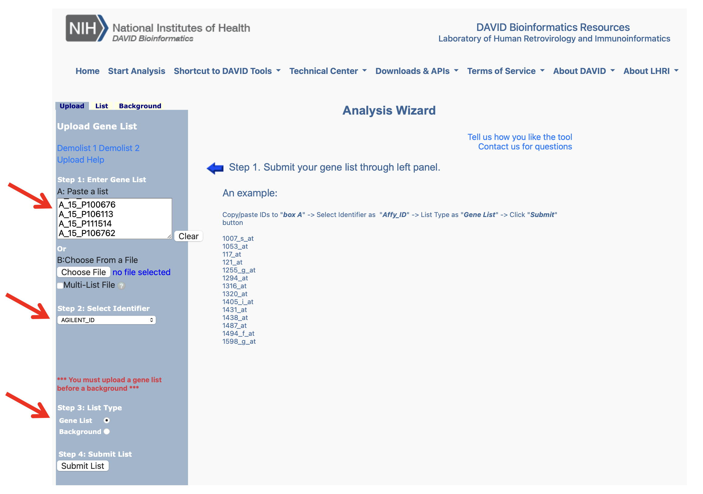
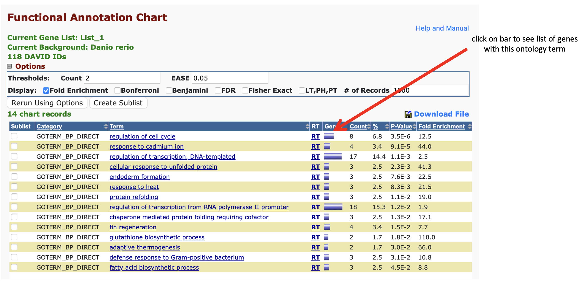

## Lab # 4 - Ontologies and Networks

## Table of Contents
1. [Introduction](#intro)
2. [The Transcriptional Impact of Industrial Compounds](#tcdd)
3. [Predicting Antimicrobial Resistance from Genome Sequences](#amr)

## Introduction

In this lab we are going to examine the use of ontologies to provide functional interpretation of experimental results as well as to drive genome analytics. Our focus will be on the Gene Ontology and Antibiotic Resistance Ontology.

**Lectures** - [Lecture 4 slides](https://github.com/agmcarthur/Biochem-3BP3/blob/master/Lectures/Lecture%204%20-%20Beyond%20the%20Gene.pptx) Beyond the Gene - Networks, Ontologies ([~35 minute video](https://mcmasteru365-my.sharepoint.com/:v:/g/personal/mcarthua_mcmaster_ca/EXEVZSV_zatAnut9gy9cgV4BRTN3nuMoKyj3WVBwgrspKQ))

**Flash Updates**
* *Gene Ontology* 
* *KEGG* 
* *CARD* 

**Demo Videos**
* [DAVID Enrichment Tool Walkthrough](https://mcmasteru365-my.sharepoint.com/:v:/g/personal/mcarthua_mcmaster_ca/EXIMNyALxGZBk7MPRROe9ugB6lKM-XWiCOQa4_NN3fgsCA) ~20 minutes
* [CARD Walkthrough](https://mcmasteru365-my.sharepoint.com/:v:/g/personal/mcarthua_mcmaster_ca/Ea8ww0PyfNhMgHk_Dep6AcEBkT7vwVx8e5LtO-k3847A1w) ~19 minutes

**Background Reading** (optional)
* Howe et al. 2008. Big data: the future of biocuration. [Nature 455:47-50](https://www.ncbi.nlm.nih.gov/pubmed/?term=18769432)
* Goble & Wroe. 2004. The Montagues and the Capulets. [Comp Funct Genomics 5: 623-32](https://www.ncbi.nlm.nih.gov/pubmed/?term=18629186)
* McArthur & Wright. 2015. Bioinformatics of antimicrobial resistance in the age of molecular epidemiology. [Curr Opin Microbiol. 27: 45-50](https://www.ncbi.nlm.nih.gov/pubmed/?term=26241506)

**Links**
* DAVID, https://david.ncifcrf.gov
* CARD, http://card.mcmaster.ca

**Computer Resources**
* You can complete this entire lab by using your web browser

**Grading**
* Questions are for your learning and are not graded
* Problems are worth 5 points each (-1 for each error)
* Submit your answers to the Problems, plus any supplmental multiple choice questions, on **A2L Quizzes** before the deadline
* An answer key to Questions and Problems will be provided on A2L after the deadline

## The Transcriptional Impact of Industrial Compounds

TCDD (2,3,7,8-Tetrachlorodibenzo-p-dioxin), commonly known as dioxin, is a potent organochlorine contaminant and a known carcinogen. tBHQ (tert-Butylhydroquinone) is an aromatic organic compound and a consumable antioxidant. Both of these compounds were used in a recent study to examine embryonic sensitivity to oxidative stress, using the zebrafish model. Oxidative stress is known to be associated with teratogenesis, cardiovascular disease, and neurodegenerative stress, yet embryonic response to oxidative stress is not well understood. Zebrafish embyros 4 days post fertilization were exposed to TCDD (2 nM) or tBHQ (10 μm) relative to a DMSO control (0.1%) and global gene expression patterns in the embryo examined using microarrays. The following relationships were known for these compounds but the study sought to determine the broader transcriptional response and whether any unknown pathways or cellular responses were involved:

TCDD – binds to the aryl-hydrocarbon receptor (AHR), which then induces expression of CYP1A, which metabolizes TCDD. A by-product of this reaction is known to be generation of reactive oxygen species. (learn more: https://pubchem.ncbi.nlm.nih.gov/compound/15625)

tBHQ – known to strongly induce the oxidative stress response (OSR), which are a suite of genes that mitigate oxidant effects. (learn more: https://pubchem.ncbi.nlm.nih.gov/compound/16043)

You will be studying the results of this experiment using the Gene Ontology and other resources. In particular, you will be using ontology term enrichment analysis to predict the biological processes and molecular functions occurring in the transcriptional response outlined in the **Figure 3** of the paper:

> Hahn et al. 2014. The transcriptional response to oxidative stress during vertebrate development: effects of tert-butylhydroquinone and 2,3,7,8-tetrachlorodibenzo-p-dioxin. PLoS One 9:e113158. [PMID 25402455](https://pubmed.ncbi.nlm.nih.gov/25402455/).

> Figure 3. Heat map illustrating changes in gene expression in zebrafish eleutheroembryos following exposure to DMSO (0.1%), tBHQ (10 mM), or TCDD (2 nM). Eleutheroembryos at 4-dpf were exposed to each chemical for 6 hours, after which RNA was isolated, cRNA prepared and hybridized against a universal reference cRNA on Agilent 22k zebrafish arrays. There were 4 biological replicates, each a pool of 30 eleutheroembryos. The probes shown exhibited statistically significant differences among groups and at least 2-fold change (tBHQ vs. DMSO or TCDD vs. DMSO).

From this GitHub repo you can download an EXCEL sheet corresponding to Figure 3, giving the lists of Agilent microarray probes underlying the figure: [Biochem 3BP3 Lab 4 - Probe List.xls](https://github.com/agmcarthur/Biochem-3BP3/blob/master/Lab_4_Ontologies/Biochem%203BP3%20Lab%204%20-%20Probe%20List.xls). Microarray probes are used to measure mRNA transcript abundance and each probe measures a different zebrafish gene. Looking at the spreadsheet, you can see the quality of annotation of each probe varies.

**Question #1. Which probe(s) measure CYP1A transcript abundance? How do TCDD and tBHQ effect CYP1A abundance?**

> Flash Update - Gene Ontology

Some of the clusters of probes in Figure 3 with correlated transcriptional patterns are quite large, making manual interpretation difficult. In this lab, you are going to use the DAVID tool (Database for Annotation, Visualization and Integrated Discovery) to provide an automated interpretation:

* Load the following site in your browser: https://david.ncifcrf.gov
* From the menu, select “Start Analysis”

Using the list of Agilent probes in the EXCEL sheet, you will compare these lists against the rest of the zebrafish (*Danio rerio*) genome. The demo video provides a demonstration, with the following important notes:

* Your *gene list* is a list of Agilent microarray probe identifiers from the EXCEL file
* The identifier you are using is *Agilent_ID*
* Your list type is *Gene List*

* If you get a warning that *less than 80% of your list has mapped to your chosen identifier type*, select *Continue to Submit the IDs That DAVID Could Map*
* Visualize your results using the *Functional Annotation Tool*
* DAVID analyzes for term enrichment in many data sets, but only up to 10 are highlighted by default (shown in red). We will only be using these 10 in our analysis. Note that GOTERM_##_FAT translates as BP = Biological Process, MF = Molecular Function, CC = Cellular Component

**Note**: When looking at the individual charts of enriched terms, select options EASE Threshold of 0.05 and Display Fold Enrichment. EASE is a corrected Fisher’s Exact Test and the standard is to use p<0.05.  Try sorting by Fold Enrichment.

**Question #2. Explore the *Help and Manual* link to understand the output. If EASE is a version of the Fisher’s Exact Test, what is the null hypothesis when testing for enrichment of a specific ontology term?**

**Problem #1. After a demo from your instructor, perform DAVID analysis of the Cluster 1, Cluster 2, Cluster 3 and Cluster 4 probe lists that include up- or down-regulation of genes in response to tBHQ and TCDD using the Gene Ontology. Write a short paragraph (1/2 page maximum) outlining your findings and interpretation. What are the main responses in these embryonic cells to insult by tBHQ and/or TCDD?**

> Flash Update - KEGG 

**Problem #2. Look at the KEGG pathway results for Cluster 1, *Up-regulated in tBHQ*. A number of signalling pathways are enriched for this probe set. Are there any proteins enriched in more than one of these signalling pathways? Looking at the KEGG signalling pathway plots, what are they and what biology is being upregulated?**

## Predicting Antimicrobial Resistance from Genome Sequences

> Flash Update - CARD 

One of today’s Flash Updates will outline the Comprehensive Antibiotic Resistance Database, focussing on the current public version, http://card.mcmaster.ca. At the heart of the CARD is the Antibiotic Resistance Ontology (ARO). After a brief demo, work through the following questions:

**Question #3. Browsing from the CARD home page, what are the seven major branches of the ARO?**

**Question #4. How many major drug classes are represented in the ARO?**

**Question #5. Using the search box, find the ARO term for the MCR-1.1 protein. Outline what drugs MCR-1.1 confers resistance to and via which mechanism. Explain the mechanism by exploring the ARO terms associated with MCR-1.1.**

**Problem #3. Again using the search box, contrast MCR-1.1 and ethambutol resistant embB genes. How does the mechanism of resistance differ between these two genes? What extra information is required in the embB detection model?**

**Question #6. Using the Resistance Gene Identifier software, analyze plasmid HQ451074.1. Perfect = perfect matches to reference sequences in the CARD, Strict = allowable variants of the reference sequences in the CARD using curated cut-offs, Loose = sequences with similarity to CARD reference sequences, but outside of detection model cut-offs. Trying the RGI visualizations or the Chart View, which are all based on the ARO, and only using Perfect and Strict hits (keeping defaults: exclude nudge, high quality/coverage), what resistance genes or variants exist in this plasmid sequence, which drugs classes do they confer resistance to, and via which mechanisms?**

**Question #7. Plasmid HQ451074.1 above confers resistance to the *nucleoside antibiotic* tunicamycin, but this is not explained by the Perfect and Strict hits. Can you explain this by looking at Loose hits? How good is the evidence?**

**Problem #4. Using the Resistance Gene Identifier software, analyze *Salmonella enterica* genome AE014613.1 (Perfect and Strict only). Which mutation-based antimicrobial resistance is present in this genome (*hint: sort by the SNP column*), i.e. which genes and effected drugs? Are any of these detected mutations from the same pathogen? Do you think this pathogen will be resistant to these drugs?**

