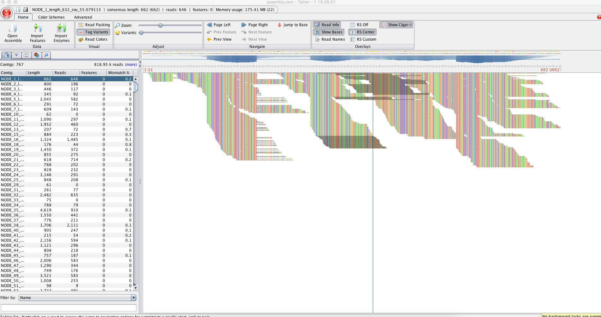
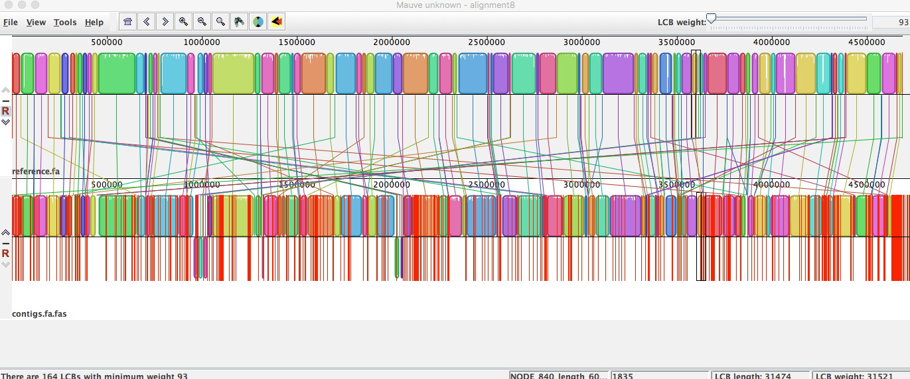
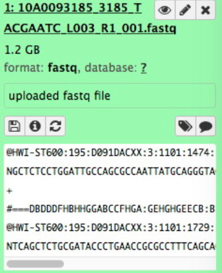

## Lab # 6 - FASTQ and Genome Assembly

## Table of Contents
1. [Introduction](#intro)
2. [VELVET Genome Assembly](#velvet)
3. [Visualization](#visual)
4. [Galaxy](#galaxy)

<a name="intro"></a>
## Introduction

The goal of this lab is to improve student usage of the Linux operating system and the *command line*, in the context Illumina FASTQ DNA sequencing data and microbial genome assembly. Students will additionally be introduced to cloud computing and the Galaxy framework for bioinformatics analyses.

Flash Updates - Illumina Sequencing, FASTQ, Galaxy

**Lectures** - [DNA Sequencing & Genome Assembly](https://github.com/agmcarthur/Biochem-3BP3/blob/master/Lectures/Lecture%205%20-%20Genome%20Assembly.pptx)

**Flash Updates**
* *Illumina Sequencing*. Review the Illumina DNA sequencing method, using the MiSeq platform as an example. [Nat Biotechnol. 30:434-9](https://www.ncbi.nlm.nih.gov/pubmed/?term=22522955) and http://www.illumina.com/technology/next-generation-sequencing/sequencing-technology.html (you may use images from the “Illumina Sequencing Introduction” PDF).
* *FASTQ*. Introduce the FASTQ file format, review how it was developed for Next-Generation Sequencing (NGS). Review the concept of base calling quality and how it is encoded in FASTQ. [Nucleic Acids Res. 2010 38:1767-71](https://www.ncbi.nlm.nih.gov/pubmed/?term=20015970). Note: We will be handling recent Illumina FASTQ data, which uses an offset of 33, see https://en.wikipedia.org/wiki/FASTQ_format.
* *Galaxy*. Introduce the Galaxy platform for bioinformatics analysis and how it relates to Cloud computing (focus on CloudMan and Amazon Web Services). See [Genome Biol. 2010 11:R86](https://www.ncbi.nlm.nih.gov/pubmed/?term=20738864) and https://wiki.galaxyproject.org/BigPicture/Choices.

**Background Reading** (optional)
* Myers et al. 2000. A whole-genome assembly of *Drosophila*. [Science 287:2196-2204](https://www.ncbi.nlm.nih.gov/pubmed/?term=10731133)
* Pop. 2009. Genome assembly reborn: recent computational challenges. [Brief Bioinform. 10:354-66](https://www.ncbi.nlm.nih.gov/pubmed/?term=19482960)
* Tritt et al. 2012. An integrated pipeline for *de novo* assembly of microbial genomes. [PLoS One. 7:e42304](https://www.ncbi.nlm.nih.gov/pubmed/?term=23028432)

**The Lab**
* The computers in the laboratory are terminals - clients within a large maintained computer system. They have limited computational power - often we will be using them to access web-based tools or specialized servers with more computational resources.
* You log into the computers using your MacID. You will be automatically logged out after 10 minutes of mouse inactivity. Use **CAFFEINE** to override the automatic log out - **REMEMBER TO LOG OUT MANUALLY AT THE END OF THE LAB**.
* All files and work on the computers will be lost when you log out. Be sure to save your work elsewhere. 

**Grading**
* The WORD file for answers is available on A2L, be sure to submit your answers on **A2L Quizzes** before the deadline.
* An answer key will be provided on A2L after the deadline
* Questions are group participation, zero points
* Problems are worth 5 points each (-1 for each error) = 15 points maximum

**Terminal**
* Part of today’s lab will be performed at the command line and is meant to expand your linux skills. You may need your notes from the last lab as a cheat sheet. Remember, case matters for linux computers. Unless otherwise indicated, use lowercase.
* uppsala.mcmaster.ca is behind the McMaster firewall and requires VPN to connect from off campus or from the MacSecure wireless network.

<a name="velvet"></a>
## VELVET Genome Assembly

We are going to perform a command line assembly of a *Salmonella* genome that was sequenced using the Illumina platform using a kmer assembler called VELVET.

**WE RECOMMEND YOU WORK IN TEAMS OF THREE or FOUR FOR BETTER SERVER PERFORMANCE**

> Flash Update - Illumina Sequencing [kahoot](https://kahoot.it/?_ga=2.264238917.871462812.1568207895-297922416.1568207895)

> Flash Update - FASTQ [kahoot](https://kahoot.it/?_ga=2.264238917.871462812.1568207895-297922416.1568207895)

To start:
* Log into uppsala.mcmaster.ca
* Create a working directory for yourself (e.g. *agmcarthur*) 
* Move into your working directory

The FASTQ data you need is in the following files. Place copies in your working directory.

> /home/biochem3bp3/data/Salmonella_3185_TACGAATC_L003_R1_001.fastq
> /home/biochem3bp3/data/Salmonella_3185_TACGAATC_L003_R2_001.fastq

**Question #1. These two files contain the *forward*  (R1) and *reverse* (R2) sequencing reads of this genome sequencing project. Given that the following command will tell you how many lines are in a file, how many DNA molecules have been sequenced and how many sequences are there?**

```bash
wc -l <filename>
```

Take a look at one of the FASTQ files to remind yourself of the format and how sequencing quality is encoded:

```bash
less <filename>
```

We have installed software from the FASTX-Toolkit (http://hannonlab.cshl.edu/fastx_toolkit/index.html) to perform some quality control steps on these data before assembling the genome. Let’s first look at how quality varies along the sequences:

```bash
cat /home/biochem3bp3/data/*.fastq | fastx_quality_stats -Q33 -o sequences.stats
```

You needed to add the -Q33 parameter to tell it that you're using Illumina encoded quality scores, not Sanger encoding. First take a look at the contents of *sequences.stats* using the command line and then download the pre-calculated EXCEL spreadsheet in A2L/GitHub to view on your computer. You can find a key to the column labels here: http://hannonlab.cshl.edu/fastx_toolkit/commandline.html#fastq_statistics_usage

**Question #2. Looking at the plot, we want trim the reads where the average quality becomes worse than a 1 in 100 error rate (Q20). At what position along the read on average would you trim the data?**

Now trim the reads by length using the following command, but replace the word POSITION with the value you decided above (*-f* is first position to keep, *-l* is last position to keep):

```bash
cat /home/biochem3bp3/data/*.fastq | fastx_trimmer -Q33 -f 1 -l POSITION > sequences.trim
```

We now want to additionally clip and filter the reads. The clipping removes the synthetic Illumina DNA adaptor sequence *TACGAATC* while the filter removes any reads of length less than 32 bp after removal of the adaptor. We pick 32 bp as when we assemble we will be using 31 bp kmers. The *-v* is for verbose mode, giving a summary of the results.

```bash
fastx_clipper -Q33 -l 32 -v -a TACGAATC -i sequences.trim -o sequences.clip
```

**Question #3. How many sequences passed this filter?**

Lastly, we want to perform a quality filter, such that we only keep sequencing reads for which at least 95% of bases are Q20 or better:

```bash
fastq_quality_filter -Q33 -q 20 -p 95 -v -i sequences.clip -o sequences.filter
```

**Question #4. How many sequences passed this quality filter?**

Now look at the results to see how the data have changed:

```bash
less sequences.filter
```

The original data were paired reads (i.e. forward & reverse) but some of the pairs may have been lost by the filtering. The Velvet assembly algorithm treats paired and unpaired reads differently as only the former can create scaffolds, so we need to put these in different files using one of Dr. McArthur’s Perl scripts:

```bash
fastq_interleave sequences.filter
ls
```

**Question #5. How many paired and unpaired reads are in the final pre-assembly data?**

**Question #6. This strain of *Salmonella* is expected to be ~4,600,000 bp in size. What base pair coverage are we about to submit to the Velvet assembly?** 

We are now going to use the Velvet assembly to make contigs and scaffolds. First we need to make an assembly directory and then calculate the kmers present in the sequencing reads. The Velvet algorithm requires the kmer value to be an odd number to avoid palindromes. Longer kmers bring more specificity, but lower coverage. The Velvet package has been found to perform well with kmer length of 31 bp:

> Something went wrong above and you need correct results for the VELVET assembly? Type "cp ../result/* ."

```bash
mkdir draft_assembly
velveth draft_assembly 31 -fastq -shortPaired sequences.filter.paired -short sequences.filter.unpaired
```

With the kmer sequences and their frequencies now calculated, we can have Velvet determine the de Bruijn graph for these sequencing reads and use the Eulerian path to resolve contigs. The paired reads will then be used to create scaffolds among the contigs. We are going to let the Velvet assembler determine the expected kmer coverage from the data itself and thus determine the minimum coverage cut-off for forming contigs. Once the assembly is done, we will use one of Dr. McArthur’s Perl scripts to summarize the results:

```bash
velvetg draft_assembly -cov_cutoff auto -exp_cov auto
scaffoldstats draft_assembly/contigs.fa
```

**Question #7. If you browse through the output, how many kmers were found in the sequencing data?**

**Question #8. What fraction of the sequencing reads contributed to the final assembly?**

**Question #9. The Final Graph in Velvet refers to the contig sequences, whereas the output of scaffoldstats refers to scaffolds. Is the N50 higher for the scaffolds than the contigs? Why?**

**Question #10. Why is the final estimated coverage lower than what we estimated in Question 6?**

Record some statistics for later comparison:

* Total number of scaffolds:
* Total scaffold assembly length (bp):
* Scaffold N50 (bp):
* Largest scaffold (bp):

<a name="visual"></a>
## Visualization

We now want to visualize our assembly instead of just looking at statistics. Some of these results are pre-computed since they are not quick and we are going to learn the details of Burrow's Wheeler Transform next week. 

> Visualizing BWT read mapping was performed using Tablet, https://ics.hutton.ac.uk/tablet/



_We use the Burrows-Wheeler algorithm (BWA) to align our raw sequencing reads to the assembled contigs so we can see where each read contributed to the final assembly. Usually, BWA is used to align NGS sequences to a reference genome, such as the published human genome. In this case, we are using the contigs as the reference genome. Visualizing reads that aligned to the contig *Node 1*._


_Zoom of above image to show agreement (and rare disagreement) among sequencing reads. The disagreement could be true polymorphism or sequencing errors._

> Visualizing similarity between assembly and a reference *Salmonella* genome was performed using MAUVE, http://darlinglab.org/mauve/mauve.html



_Comparison of the assembly contigs (bottom) to the complete genome sequence of a reference *Salmonella* strain (top). Blocks reflect regions of shared sequence, red lines gaps._

Using the lab computers, visualize the quality of the assembly graph, with an emphasis upon repeated sequences, using BANDAGE (https://rrwick.github.io/Bandage) and the *LastGraph.txt* file available on A2L/GitHub.

**Problem #1. Based on the Tablet, MAUVE, and BANDAGE results, what is your assessment of the quality of your genome assembly?**

<a name="galaxy"></a>
## Galaxy

> Flash Update - Galaxy [kahoot](https://kahoot.it/?_ga=2.264238917.871462812.1568207895-297922416.1568207895)

Today’s lab will use the public server of the Galaxy project, http://usegalaxy.org. It is used by thousands of researchers, so you will be sharing computational resources – not all steps will perform quickly. Use the following steps to set up your account:

* From the top menu of the site, select *User* and register for an account. This is your free account on the most complete and most maintained Galaxy server – use it whenever you have genomics data!
* Check your email account for a message from the server and confirm you registration.  This must be completed before the server will analyze your data.
* Return to the Galaxy home page.

You will receive a demonstration of the Galaxy workflow environment and will assemble a *Salmonella* genome sequencing project which will be used in next week’s molecular epidemiology laboratory.

Create a New History using the history tool and give it a name:


Once everyone has their own History, you will be shown how to upload the lab data, but first grab a copy of the data: 

[Salmonella_3185_TACGAATC_L003_R1_001.fastq.gz](http://mcarthurbioinformatics.ca/assembly/Salmonella_3185_TACGAATC_L003_R1_001.fastq.gz5)

[Salmonella_3185_TACGAATC_L003_R2_001.fastq.gz](http://mcarthurbioinformatics.ca/assembly/Salmonella_3185_TACGAATC_L003_R2_001.fastq.gz)

These are the forward and reverse FASTQ read files for a *Salmonella* assembly data set. The data files will show up on the right panel in green when you succeed:



By click on the file name you will expand the green box to see all the contents. The *eye* icon at the top will show the contents on the main screen. The *i* icon in the middle of the green box will show the file and analysis details, including STDOUT (important!).

> Galaxy Hints: Green = Done, Yellow = Running, Red = Error, Gray = Queued

**FASTQC**

You will be shown how to use the FASTQC tool. Run FASTQC on both data files and you will generate raw and web page results for both files. Full details on all the plots can be found here: http://www.bioinformatics.babraham.ac.uk/projects/fastqc/Help/3%20Analysis%20Modules/


For each position a BoxWhisker type plot is drawn. The elements of the plot are as follows:

* The central red line is the median value
* The yellow box represents the inter-quartile range (25-75%)
* The upper and lower whiskers represent the 10% and 90% percentiles
* The blue line represents the mean quality

The y-axis on the graph shows the quality scores. The higher the score the better the base call. The background of the graph divides the y axis into very good quality calls (green), calls of reasonable quality (orange), and calls of poor quality (red). The quality of calls on most platforms will degrade as the run progresses, so it is common to see base calls falling into the orange area towards the end of a read.

**Question #11. At what position along the reads does the mean quality fall below Q20? Is it the same for both the forward and reverse reads?**

**Question #12. After reading the documentation on the FASTQC plots, do you think there is any evidence that the sequence library is biased (i.e. non-random)? Explain your reasoning.**

**FASTQ GROOMER**

The FASTQ data is in Sanger / Illumina 1.9 format but needs to be in standard Sanger FASTQ format for downstream steps. Use the FASTQ GROOMER to convert the data to Sanger FASTQ.

**TRIMMOMATIC**

You will be shown how to use the TRIMMOMATIC tool to perform quality trimming on your data. Run TRIMMOMATIC on both groomed data sets (including ILLUMINACLIP). Take a look at the new FASTQ files and then analyze the results using FASTQC. 

**Question #13. How does the trimmed FASTQ data differ from the original FASTQ data? How will the trimming improve your assembly?**

**PREPARING FOR ASSEMBLY**

Just like the *fastx_trimmer* tool we used at the command line, TRIMMOMATIC may have removed some poor quality sequences, put the forward and reverse FASTQ files out of sync. First use the *FASTQ Interlacer* to merge all of the **paired** data into one file and then *FASTQ De-Interlacer* to split the resulting file into Forward, Reverse, and Orphan reads. Almost all assemblers required FASTQ data sorted in this manner to save on initial processing. The most common reason for a failed assembly is skipping this step.

**SPADES ASSEMBLY**

At the command line we used the older assembler VELVET and in the lecture we learned about the all-in-one microbial assembler A5.  We are going to perform our final assembly using the SPAdes assembler, which is considered the best for kmer based assembly. SPAdes has powerful defaults, so perform the SPAdes assembly using the FASTQ De-Interlacer results and without changing any of the parameters, except for:

* Careful Correction? NO (just to save time for the lab, please normally use this)
* You are performing assembly of Paired-end / Single Reads
* The forward reads should be the FASTQ De-Interlacer left mates
* The forward reads should be the FASTQ De-Interlacer right mates

Note that this instance of SPAdes in Galaxy only uses 1 processor. Normally you would use as many processors as possible to speed up your analysis.

**VISUALIZATION**

Run the SPAdes stat tool to visualize the scaffold and contig results, highlighting regions of low coverage or short contig length. Also, in A2L/GitHub is the *assembly_graph.fastg* file that can be used in BANDAGE to visualize the assembly (pre-computed for you).

**INTERPRETATION**

By the end of the lab, you should have all of the steps in the Galaxy que. Once they are all complete, using the SPAdes log (look at the bottom), SPADes stat plots, the BANDAGE plot, and the statistics in the SPAdes contig stats and SPAdes scaffold stats output (both downloadable for EXCEL) record the following stats and answer the following questions:

* Total number of contigs:
* Contig N50 (bp):
* Median Contig coverage:
* Total number of scaffolds:
* Total scaffold assembly length (bp):
* Scaffold N50 (bp):
* Largest scaffold (bp):

**Problem #2. Based on the statistics above, do you think this is a high quality assembly of a *Salmonella* genome? Explain your reasoning.**

**Problem #3. Compare this assembly to the command-line Velvet assembly. The SPAdes assembly had more FASTQ data and a better algorithm, but what specifically improved in the assembly?**
