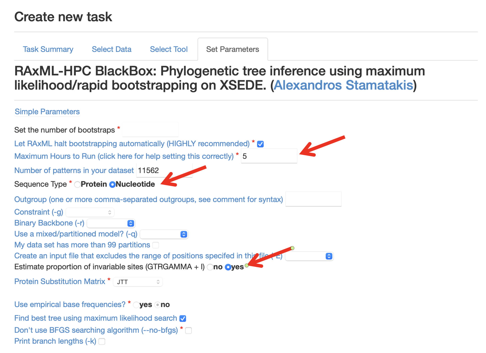

## Lab # 7 - Molecular Epidemiology

## Table of Contents
1. [Introduction](#intro)
2. [Data](#data)
3. [Tasks](#tasks)
4. [Questions](#questions)

## Introduction

The goal of this lab is to develop molecular epidemiology skills by examining a *Salmonella* outbreak using genomic data.

**Lectures** - [Lecture 7](https://github.com/agmcarthur/Biochem-3BP3/blob/master/Lectures/Lecture%206%20-%20Molecular%20Epidemiology.pptx) Molecular Epidemiology 

**Flash Updates**
* *SNPs* 
* *Horizontal Gene Transfer* 
* *Metagenomics* 

**Demo Videos**
* [Using Microsoft Remote Desktop](https://mcmasteru365-my.sharepoint.com/:v:/g/personal/mcarthua_mcmaster_ca/EW0MD7r2VKNLiF9NcTSWalIBjrQKxeVJVoo6DCF06gFWUQ) ~2 minutes
* [Lab Walkthrough](https://mcmasteru365-my.sharepoint.com/:v:/g/personal/mcarthua_mcmaster_ca/EZ8orGuU_t9Gh5a16tDJhC8BKOS8c4ntb_VIN8K4d3htRA) ~15 minutes

**Background Reading** (optional)
* Mutreja et al .2011. Evidence for several waves of global transmission in the seventh cholera pandemic. [Nature 477: 462-5](https://www.ncbi.nlm.nih.gov/pubmed/?term=21866102)
* Cassidy et al. 2015. Neolithic and Bronze Age migration to Ireland and establishment of the insular Atlantic genome. [Proc Natl Acad Sci U S A. Dec 28. pii: 201518445](https://www.ncbi.nlm.nih.gov/pubmed/?term=26712024)
* Li & Durbin. 2010. Fast and accurate long-read alignment with Burrows-Wheeler transform. [Bioinformatics 26: 589-95](https://www.ncbi.nlm.nih.gov/pubmed/?term=20080505)

**Links**
* https://pathogen.watch - Pathogen Watch, a Global Platform for Genomic Surveillance
* CARD: Comprehensive Antibiotic Resistance Database, http://card.mcmaster.ca
* RAxML Blackbox at CIPRES, http://www.phylo.org/index.php/
* Archaeopteryx, https://www.phylosoft.org/archaeopteryx/

**Computer Resources**
* This lab will use McMaster's virtual Windows servers, so you need to install and set-up [Microsoft Remote Desktop](https://uts.mcmaster.ca/services/teaching-and-learning/computer-labs/#tab-content-how-to-connect) on your personal computer. See the demo video on how to login using Microsoft Remote Desktop and your MacID.
* All files and work on the virtual servers will be lost when you log out. Be sure to save your work elsewhere (e.g., email yourself a copy).

**Grading**
* Questions are for your learning and are not graded
* Problems are worth 5 points each (-1 for each error)
* Submit your answers to the Problems, plus any supplmental multiple choice questions, on **A2L Quizzes** before the deadline
* An answer key to Questions and Problems will be provided on A2L after the deadline

## Data

In the previous lab you assembled a *Salmonella enterica* genome sequence, learning the steps of how to filter and assemble raw Illumina sequencing reads to form genome contigs and scaffolds. Now you are going to analyze 45 *Salmonella enterica* genomes from an outbreak. These samples are from 2012, when Public Health Ontario encountered a spike in food poisoning from a number of locations in Ontario, later determined to be *Salmonella* by traditional culture methods. Each isolate had DNA extracted, sequenced, and genome assembled. There is also one metagenomic sequencing data set from a single patient, for reasons explained below.

* [FASTA genome sequences](https://github.com/agmcarthur/Biochem-3BP3/tree/master/Lab_7_Epidemiology/FASTA)
* [PARSNP whole-genome SNP alignment](https://github.com/agmcarthur/Biochem-3BP3/tree/master/Lab_7_Epidemiology/PARSNP)
* [Gut metagenomics assembly](https://github.com/agmcarthur/Biochem-3BP3/tree/master/Lab_7_Epidemiology/metagenomics)

## Tasks

Your instructor will demonstrate the software needed to complete the following tasks:

> Flash Update - SNPs 

1. https://pathogen.watch provides molecular typing tools for a number of pathogens. While it does not have a core genome MLST (cgMLST) framework for *Salmonella enterica*, it can perform traditional MLST profiling. Upload the [FASTA genome sequences](https://github.com/agmcarthur/Biochem-3BP3/tree/master/Lab_7_Epidemiology/FASTA) to Pathogen Watch to examine the MLST typing.

> Flash Update - Horizontal Gene Transfer 

2. In addition to Pathogen Watch, these genomes have been run through the PARSNP algorithm to catalog whole-genome SNPs (less SNP dense regions indicative of horizontal gene transfer). The result is a PHYLIP format [PARSNP whole-genome SNP alignment](https://github.com/agmcarthur/Biochem-3BP3/tree/master/Lab_7_Epidemiology/PARSNP) file that also includes a reference sequence from the same MLST as well as the strain labels from a k-mer analysis. Perform a RAxML analysis (http://www.phylo.org/index.php/) to determine fine-resolution relationships of these strains. **Note**: this is a nucleotide alignment, not a protein alignment, but as before include a gamma model of rate heterogeneity, a maximum likelihood search, and estimated proportion of invariable sites. See [Lab 3 Phylogenetics](../Lab_3_Phylogenetics) for a reminder. The results file to look at is *RAxML_bipartitions.result* and the results are easier to look as a cladogram (i.e. no branch lengths).

3. *Salmonella* infections are often treated without antibiotics, except for severe cases in which trimethoprim (pediatric) or fluoroquinolones (adult) are used. If you find evidence of clonal outbreaks in your data, sample a [FASTA genome sequence](https://github.com/agmcarthur/Biochem-3BP3/tree/master/Lab_7_Epidemiology/FASTA) from each major clade for Resistance Gene Identifier analysis (part of http://card.mcmaster.ca). 

> Flash Update - Metagenomics

4. Unexpectedly, a single patient has proven abnormally resistant to antibiotics, suggesting the *Salmonella* is not the only pathogen involved, even though it is the only pathogen successfully isolated by culture. This patient has had their fecal metagenome sequenced and assembled by the McArthur lab: [gut metagenomics assembly](https://github.com/agmcarthur/Biochem-3BP3/tree/master/Lab_7_Epidemiology/metagenomics). Use the Resistance Gene Identifier (part of http://card.mcmaster.ca) to screen these putative AMR alleles for antimicrobial resistance genes. **Note**: the predicted alleles may only be fragments, so use RGI's Low Quality/Coverage setting but still only look for Perfect/Strict hits.

## Questions

**Question #1. Are all your outbreak samples from the same known MSLT? Are any from novel or unresolved MLSTs?**

**Question #2. If some MLST are unresolved, explain why for one sample.**

**Problem #1. Based on your answer to Question #1 and #2 above, is there any evidence that this is not a single source outbreak of *Salmonella*? Explain.**

Examine your RAxML results in Forester or another tree viewing program as a cladogram (i.e. no branch lengths). Midpoint root the tree and order subtrees to answer the following questions.

**Question #3. How many positions in the genome of *Salmonella enterica* are being used to generate the phylogenetic tree?**

**Question #4. Do the various strain labels assigned by k-mers form monophyletic clades with strong bootstrap support? If not, why do you think this is the case? You can ignore the small number of samples that were not assigned to a specific strain.**

**Question #5. Given that the reference sequence NC_011294 may be very closely related to the Ontario strains but all other reference sequences are from different MLSTs and outbreaks, is there any evidence that the Ontario samples do not reflect a single source outbreak of *Salmonella*? Think carefully about the bootstrap values.**

**Problem #2. Sample 17 is a Nurse suspected of poor hand hygiene leading to infection of a number of patients (sample 14, 11, 35), including himself. Does the RAxML tree provide evidence supporting this suspicion? Is there evidence of further hospital acquired infections? Explain.**

**Problem #3. Chicken burgers distributed by a local food supplier have been found to be contaminated with *Salmonella* (samples 4 & 5). Subsequently, several patients (samples 2, 7, 8, 15) known to have eaten (and possibly undercooked) these chicken burgers were additionally found to have *Salmonella* infections. Is there evidence of a single source of all these infections? Could the illness of additional patients possibly be explained by contaminated chicken burgers? Explain. (hint: bootstrap support is very important for these interpretations)**

**Question #9. *Salmonella* infections are often treated without antibiotics, except for severe cases in which trimethoprim (pediatric) or fluoroquinolones (adult) are used. If you find evidence of independent sub-clades in your RAxML tree (i.e. separated by strong bootstrap support and possibly reflecting strain labels), sample a genome from each subset for Resistance Gene Identifier analysis. What is the predicted susceptibility to trimethoprim or fluoroquinolones? Could you use either drug for treatment of these sub-clades? Note: trimethoprim is a diaminopyrimidine antibiotic.**

Use the metagenomics results to answer the following questions:

**Question #10. For the single patient that is abnormally resistant to antibiotics, does the metagenomics analysis concur that resistance to drugs beyond trimethoprim or fluoroquinolones exists in this microbiome? Which additional drug classes may not work against this microbiome?**

**Problem #4. Clinical treatment of this patient illustrated failure of macrolide antibiotics. What AMR genes are possibly causing this resistance and what is the mechanism? Can you make a prediction of which pathogen beyond *Salmonella* could be infecting this patient?**

