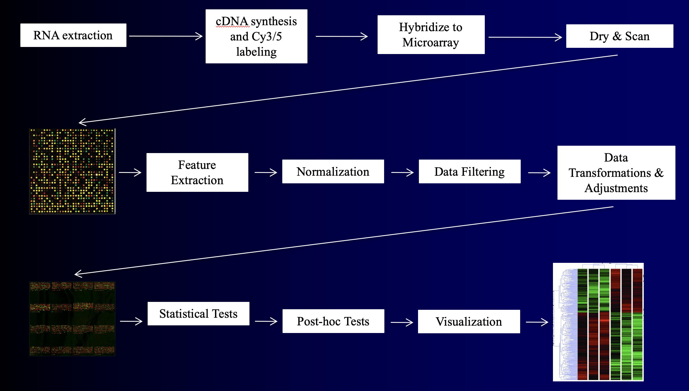
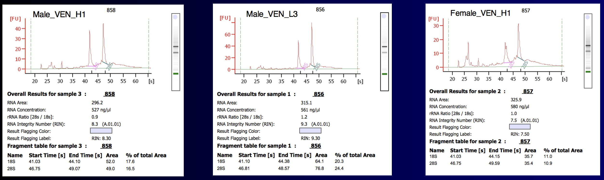
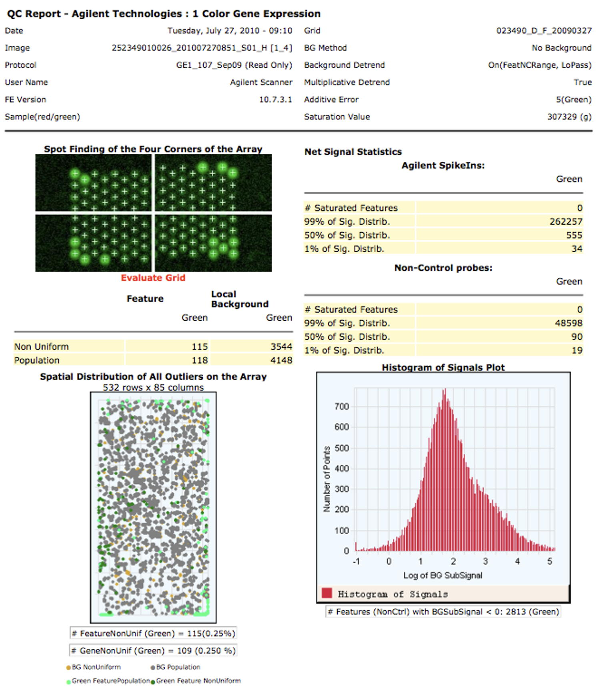
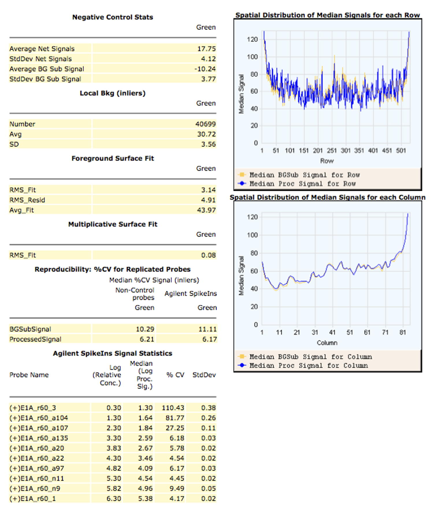
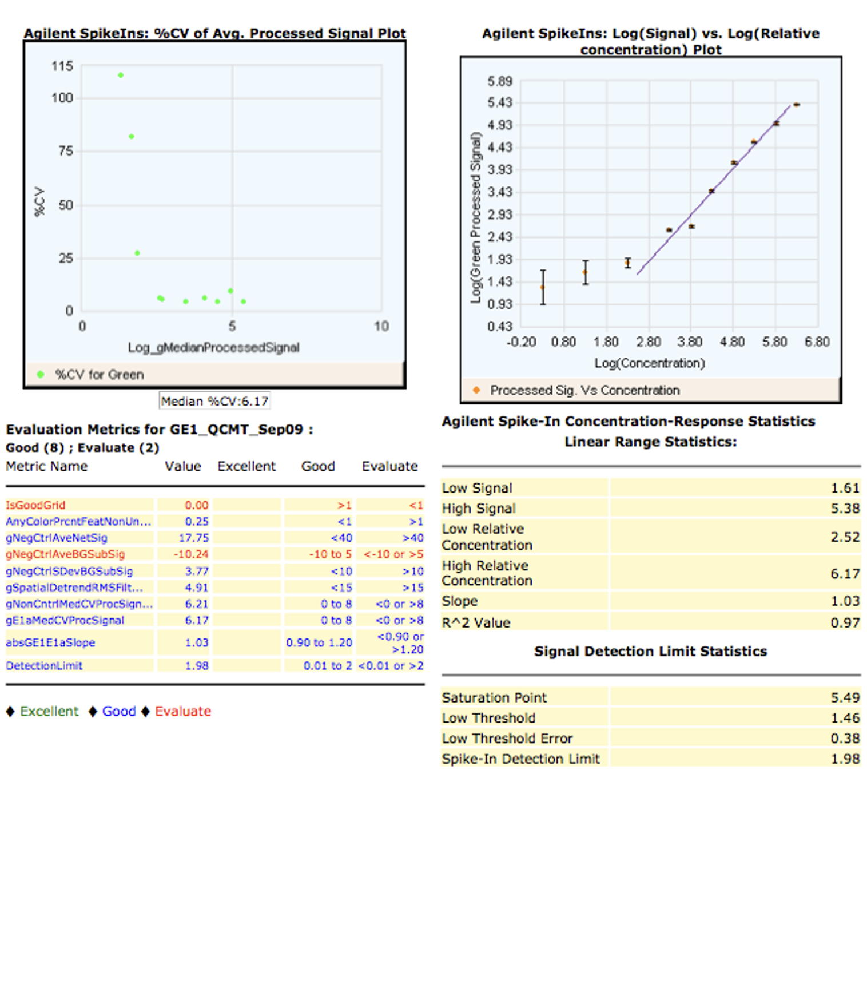
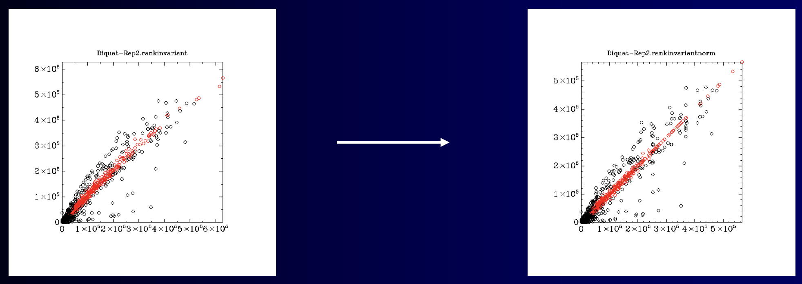
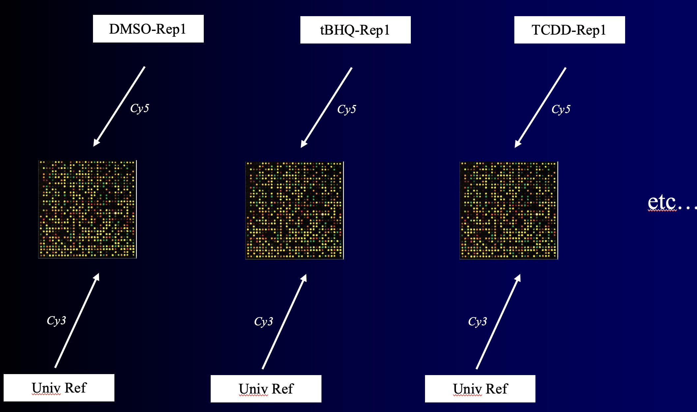
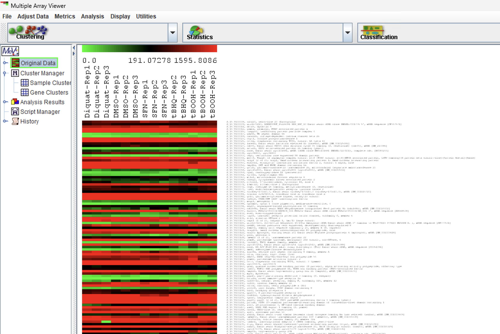

## Lab # 8 - Microarrays

## Table of Contents
1. [Introduction](#intro)
2. [Flow Chart](#flowcart)
3. [Sample Quality Control](#qc)
4. [Normalization of Single Channel Data](#normalization)
5. [Data Filtering](#filtering)
6. [Statistical Analysis](#statistics)

## Introduction

The goal of this lab is to review the analysis of microarray data.

**Lectures** - [Lecture 8](https://github.com/agmcarthur/Biochem-3BP3/blob/master/Lectures/Lecture%207%20-%20Gene%20Expression.pptx) Gene Expression Analysis ([~53 minute video](https://mcmasteru365-my.sharepoint.com/:v:/g/personal/mcarthua_mcmaster_ca/EVZILkwDnoRNsN2tNnrK2bABvOLJN8yViC0buLAeQNY5ZQ))

**Flash Updates**
* *Microarrays* 
* *Normalization* 
* *False Discovery* 

**Demo Videos**
* [Using Microsoft Remote Desktop](https://mcmasteru365-my.sharepoint.com/:v:/g/personal/mcarthua_mcmaster_ca/EW0MD7r2VKNLiF9NcTSWalIBjrQKxeVJVoo6DCF06gFWUQ) ~2 minutes
* [Lab Walkthrough - Intro through Data Filtering](https://mcmasteru365-my.sharepoint.com/:v:/g/personal/mcarthua_mcmaster_ca/EahJFGawelRBqGBXyC-4MqwB4XsToxSZcqtDt7WEOh0rIw) ~35 minutes
* [Lab Walkthrough - MeV](https://mcmasteru365-my.sharepoint.com/:v:/g/personal/mcarthua_mcmaster_ca/EUTzD-qHF2dOp-9Q2GZ1pFMBdZdccqruQhl6qtuqmHqjqw) ~18 minutes

**Background Reading** (optional)
* Hahn et al. 2014. The transcriptional response to oxidative stress during vertebrate development: effects of tert-butylhydroquinone and 2,3,7,8-tetrachlorodibenzo-p-dioxin. [PLoS One 9:e113158](https://www.ncbi.nlm.nih.gov/pubmed/?term=25402455)
* Ferella et al. 2014. Gene expression changes during Giardia-host cell interactions in serum-free medium. [Mol Biochem Parasitol. 197:21-3](https://www.ncbi.nlm.nih.gov/pubmed/?term=25286381)

**Links**
* http://mev.tm4.org - Microarray Software Suite TM4’s Multi-Experiment Viewer

**Computer Resources**
* This lab will use McMaster's virtual Windows servers, so you need to install and set-up [Microsoft Remote Desktop](https://uts.mcmaster.ca/services/teaching-and-learning/computer-labs/#tab-content-how-to-connect) on your personal computer. See the demo video on how to login using Microsoft Remote Desktop and your MacID.
* All files and work on the virtual servers will be lost when you log out. Be sure to save your work elsewhere (e.g., email yourself a copy).

**Grading**
* This is a participation lab, not graded.
* An answer key will be provided on A2L after the deadline.

## Flow Chart and Exercises

This lab walks through a series of data and steps in microarray analyses, with a focus on signal processing, filtering, and normalization. Experimental design and results slides are available in the file [Biochem 3BP3 Lab 8 Microarray.pptx](Biochem_3BP3_Lab8_Microarray.pptx) as well as shown in the walkthrough video, all referring to the Microarray Flow Chart presented in the lecture:

## Sample Quality Control

> Flash Update - Microarrays 

You will be shown BioAnalyzer results for assessment of RNA quality:

After cDNA synthesis, labelling, hybridization, and scanning you will also be shown Feature Extraction results:

| page 1 | page 2 | page 3 |
|-----|-----|-----|
|  |  |  | 

**Question #1 – Which molecules can be used as indicators of RNA sample quality? How are they assessed?**

**Question #2 – For the Feature Extraction example shown, was there evidence of overloading of the microarray (i.e. saturation) or poorly hybridized spots (non-uniform)?**

## Normalization of Single Channel Data

> Flash Update - Normalization 

**Example #1** illustrates Rank Invariant Probe normalization of the microarray data, needed since each microarray has received slightly differ amounts of labelled cRNA.  

You will need the following:

* File [normalization.xlsx](https://github.com/agmcarthur/Biochem-3BP3/blob/master/Lab_8_Microarrays/normalization.xlsx)
* A web browser open to [mcarthurbioinformatics.ca/microarrays](http://mcarthurbioinformatics.ca/microarrays)

Normalization by Rank Invariant Probes is a four step process:

* Determine the median signal Cy3 for each microarray
* Determine the microarray with the median of all median signals – this is the *baseline* microarray
* For each microarray, rank the probes from highest signal to lowest
* Normalize each microarray relative to the baseline microarray:
  * Find all probes with the same rank among the two microarrays
  * Use these rank invariant probes to create a normalization curve using a piecewise linear running median
  * Normalize the microarray

**Question #3 - Which microarrays had the highest and lowest Cy3 loadings?**

**Question #4 - Which microarray required the most normalization?**

## Data Filtering

From **Example 2**, you will next look at some normalized data from an experiment that performs a two-dye hybridization, where for each microarray the Cy3 (green) RNA is from a universal mRNA reference. 

You will need:

* File [filtering.xlsx](filtering.xlsx)

**Question #5 - What is the most highly expressed gene for the tBHQ, TCDD, and DMSO samples?**

**Question #6 - What is the most highly expressed gene in the Universal Reference samples?**

**Question #7 - Are there saturated probes? How many and in which samples? Is there saturation in the Universal Reference?**

**Question #8 - Are there non-uniform features for the Universal Reference or any of the experimental samples?**

**Question #9 – A Universal Reference is constructed from combining mRNA from many samples, tissues, time points, etc. The goal is for it to have some signal for every probe on the microarray so the fold change calculation (experimental mRNA / universal reference mRNA) does not have a zero denominator. What fraction of probes have meaningful signal for the Universal Reference? Is this a good Universal Reference?**

## Statistical Analysis

> Flash Update - False Discovery 

In **Example #3**, you will take the normalized data from the zebrafish oxidative stress experiment examined above and perform a statistical analysis. 

You will need:

* files *oxidative-stress.txt* and *oxidative-stress-design.txt*, available in [oxidative-stress.zip](oxidative-stress.zip)

We will use [MeV](http://mev.tm4.org) to analyse these data. Initial steps:

* Log transform the data to reduce Power Relationships in the data
* Median centre the probes to down-play abundance and focus on variation
* Adjust the visualization scheme

For each of the following tests, how many probes were significant? What do you think is influencing the analysis most – false positives, false negatives, both, or neither?

**ANOVA 1**: f-distribution, p<0.01, no Bonferroni 

**ANOVA 2**: f-distribution, p<0.01, Adjusted Bonferroni correction

**ANOVA 3**: permutated distribution, p<0.01, no Bonferroni 

**ANOVA 4**: permutated distribution, p<0.01, Adjusted Bonferroni 

**ANOVA 5**: permutated distribution, p<0.01, 5% FDR

**ANOVA 6**: permutated distribution, p<0.05, 5% FDR

**ANOVA 7**: permutated distribution, p<0.05, 1% FDR

**Question #10 – Explain the different result for the above tests – why did they have different numbers of significant probes?**

