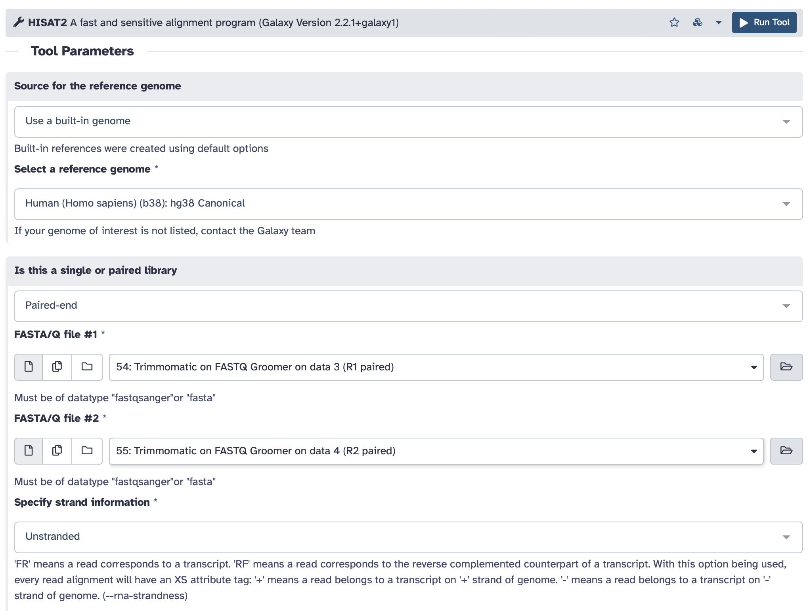

## Lab # 9 RNA-Seq

## Table of Contents
1. [Introduction](#intro)
2. [Setting Up](#setup)
3. [The Experiment](#experiment)
4. [Data Cleaning](#clean)
5. [Mapping Reads to the Human Genome](#mapping)
6. [Transcript Assembly](#transcripts)
7. [Differential Gene Expression Analysis](#dge)
8. [Interpretation](#interpretation)

## Introduction

The goal of this lab is to review the analysis of RNA-Seq data using the public Galaxy platform.

Flash Updates - RNA-Seq, Illumina HT-12, Tn-Seq

**Links**
* http://usegalaxy.org - Today’s lab will be performed using the public Galaxy website

**The Lab**
* The computers in the laboratory are terminals - clients within a large maintained computer system. They have limited computational power - often we will be using them to access web-based tools or specialized servers with more computational resources.
* You log into the computers using your MacID. You will be automatically logged out after 10 minutes of mouse inactivity. Use **CAFFEINE** to override the automatic log out - **REMEMBER TO LOG OUT MANUALLY AT THE END OF THE LAB**.
* All files and work on the computers will be lost when you log out. Be sure to save your work elsewhere. 

**Grading**
* The WORD file for answers is available on A2L
* An answer key will be provided on A2L after the deadline.
* Unless otherwise indicated, all questions worth 1 point, total = 16.

## Setting Up

Today’s lab will use the public server of the Galaxy project, http://usegalaxy.org. This is a separate server from the McArthurLab Galaxy server you used for genome assembly. It is used by thousands of researchers, so you will be sharing computational resources – not all steps will perform quickly. Use the following steps to set up your account:

* From the top menu of the site, select *User* and register for an account. This is your free account on the most complete and most maintained Galaxy server – use it whenever you have genomics data!
* Check your email account for a message from the server and confirm you registration.  This must be completed before the server will analyze your data.
* Return to the Galaxy home page.
* Upload all the data files from Avenue 2 Learn (manually indicating the file type)

## The Experiment

> Flash Update - RNA-Seq

We are going to examine the response of the human transcriptome in a human lens epithelial cell line (part of the eye) exposed to Cadmium, as preliminary microarray work has suggested Cadmium exposure, via the MTF-1 transcription factor, impacts lens development and maintenance. The experiment is RNA-Seq of three Cadmium exposed replicates and 3 Control replicates, using the GRCh38 version of the human genome annotation as reference. The RNA-Seq was performed using an Illumina HiSeq with 2 x 50 bp mate pair sequencing.

We are going to manipulate these data files multiple times, so download the *Sample Tracking.xlsx* spreadsheet to keep track of each step. Start by recording the identifiers of the upload boxes.

Use the FastQC tool to examine the quality of some of the RNA-Seq data. As before, details on all the plots can be found here: http://www.bioinformatics.babraham.ac.uk/projects/fastqc/Help/3%20Analysis%20Modules/ or you can review [Lab 6](http://github.com/agmcarthur/biochem3BP3-2018/tree/master/Lab_6_Genome_Assembly).

**Question #1. How many mRNA were sequenced from each replicate and does this data need any adaptor removal or quality trimming?** (1 point)

**Question #2. This lab is using only a fraction of the total data so it does not take too long, but also perform FASTQC on the full replicate from a different experiment (adrenal.fastq). When a full RNA-Seq run is analyzed, do the samples pass FastQC's quality control checks for per-sequence GC content and sequence duplication levels? These checks passed when we were assembling bacterial genomes. If they do not pass for these RNA-Seq data, suggest reasons.** (3 points)

## Data Cleaning

Even if the data as a whole passed FASTQC, quality trimming and filtering is still highly recommended to remove or trim individual sequences of poor quality. Convert the data to Galaxy's preferred FASTQ format using *FASTQ Groomer* (default settings) and then run *Trimmomatic* (paired-end with separate input files, plus ILLUMINACLIP with TruSeq3 for paired-end MiSeq or HiSeq) on all the samples, using the *Sample Tracking.xlsx* spreadsheet to keep track of your results. For example:

**Question #3. Run *FASTQC* on a couple of your samples to see if the data has changed in quality. Has anything improved?** (1 point)

Note, Trimmomatic under these settings creates both **paired** and **unpaired** output. We only want to use paired reads in our data, so will ignore the unpaired files.

> Flash Update - Illumina HT-12

## Mapping Reads to the Human Genome

Before we can interpret these data, we need to map the FASTQ reads to the reference human genome (hg38). We cannot use the standard Burrows-Wheeler Transform software BWA or Bowtie, since RNA-Seq data needs to be corrected for introns and exons. Instead, we will use the HiSAT2 tool, which can handle splice junction boundaries as well as control for fragment sizes. 

Perform *HiSAT2* read mapping for each sample, using the hg38 built in reference: *Human (Homo sapiens) (b38): hg38 Canonical* on **each mate pair**. FASTA/Q file #1 = forward = left, FASTA/Q file #2 = reverse = right. For strand settings, use the default *Unstranded*. For example:

> Flash Update - Tn-Seq

Record the results identifiers in the the *Sample Tracking.xlsx* spreadsheet.

**Question #4. HiSAT2 creates a BAM file that contains the alignment information. Click on the HiSAT2 results for HLE Ctrl 1 replicate and then the *i* icon to access the STDERR. What percentage of read pairs aligned uniquely to one location in the genome and what percentage may represent multiple copy genes? What was the overall alignment rate? Would you say this is a good RNA-Seq data set? Why?** (3 points)

## Transcript Assembly

Now that the raw RNA-Seq data have been aligned to the reference human genome, we can assemble the data into individual transcripts as a step towards identifying differential gene expression (DGE). The *htseq-count* tool determines the transcripts at each gene in the reference and provides un-normalized counts.

Perform *htseq-count* on each replicate's *HiSAT2* BAM file, using the *gencode.v29.annotation.gtf.gz* annotation file and the *Reverse* stranded option (which reflects use of a first-strand synthesis kit during library construction). For example:

**Ignore the *(no feature)* results, as these are not mapped to genes**. Record the results identifiers in the the *Sample Tracking.xlsx* spreadsheet.

**Question #5. Examine the results of htseq-count and then using *Filter*, determine how many assembled transcripts were found in the Cadmium and Control collections (give the range covered by the three replicates).** (1 point)

## Differential Gene Expression Analysis

> Note - The DESeq2 tool will not que properly, only use it once all previous steps are complete.

We are going to use *DESeq2* to both normalize and perform significance tests on these data. To do this we have to define the factors in the experiment and assign the *htseq-count* data to these factors. The controls should be in the first factor. For example:

Make sure *Files have header?* and *Output normalized counts table* are both set to **Yes** and then run the analysis. *DESeq2* will normalize the data and perform the statistical testing as outlined in the lecture, but it will also create a table of normalized transcript counts that you could export for traditional ANOVA using MeV4 like you performed in the microarray lab.

*DESeq2* will create a results file that included significance testing (using the P-adj to reflect correction for false discovery), a principal components plot to visualize differences in overall transcriptome among the replicates, and a table of normalized counts.

**Question #6. Look at transcript differential expression testing and then try *Filter* for significant differences in transcript abundance (P-adj < 0.05). How many genes are differentially expressed in this experiment at this corrected alpha value?** (1 points)

**Question #7. Look at the normalized counts and then try *Sort* to determine the most highly expressed gene in Cadmium exposed cells. Is it the same for each replicate?** (1 point)

## Interpretation

At this point, we have a robust statistical analysis of these RNA-Seq data, with a resulting list of significantly differentially expressed genes, that are labeled using *ENSEMBL_GENE_ID* identifiers. Using the techniques of [Lab 4](http://github.com/agmcarthur/biochem3BP3-2018-dev/tree/master/Lab_4_Ontologies), use the DAVID tool (http://david.ncifcrf.gov) to interpret these results. 

> Note - DAVID gets confused with the version identifiers in these Ensembl gene identifiers. The file *Ensembl_list.txt* contains the list of significant hits with the versioning removed.

**Question #8. What is your overall interpretation of the impact of Cadmium on human lens epithelial cells?** (5 points)

